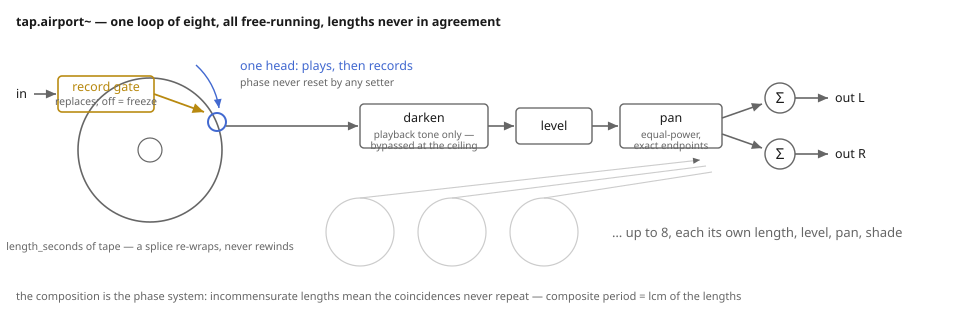
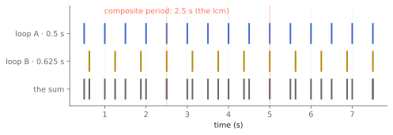

# Loops that never line up

Take seven tape loops of deliberately awkward lengths — none a multiple of
another — put one soft phrase on each, and let them all turn at once. Each
loop is trivial: it plays the same thing forever. The *system* is not: the
phrases drift against each other, meet, part, and meet again differently,
and the pattern of coincidences does not repeat within a human afternoon.
That is "2/1" from Brian Eno's *Music for Airports* (Ambient 1, EG, 1978),
as he described the rig in the album's liner notes and in *A Year with
Swollen Appendices*: the lengths are the score, and the machine's whole job
is to keep the loops turning without an opinion. `tap.airport~` is that
machine — up to eight free-running loops, each with a single head that both
plays and records, summed to stereo.

The discipline that makes it the instrument it is: **nothing resets a
phase.** Not recording, not a level move, not a pan, not even a length
change. The free-run *is* the composition, and the kernel treats the heads
as sacred; the test suite literally hammers every setter mid-run and then
checks that the heads have advanced by exactly the samples processed.

Companion material: the executed notebook `airport.ipynb`, which measured
every claim below, and the `eno_render` tool's `airport_two_one` scenario —
three stereo minutes of seven loops, the listening copy. The Max wrapper
lands in the TapTools-Max package alongside the rest of the family.

*One loop of eight. The head plays, then records, then advances; nobody ever tells it where to be.*

## Record and return

`record(loop, 1)` punches the input onto that loop's tape at wherever its
head happens to be — there is no downbeat, no quantized punch-in, because
Eno's rig had none. Recording *replaces* (each phrase was recorded once, not
overdubbed), and playback reads just ahead of the write, so while recording
you hear the previous generation under the head. `record(loop, 0)` freezes
the tape, and freezes it bit-exactly: the pinned test compares two whole
passes of a frozen loop and requires them identical to the bit. A loop is
not a degrading medium here — it replays the *same* magnetic imprint every
revolution, which is why this kernel deliberately has no per-pass
generation loss (that is `tap.discreet~`'s physics, not a loop's).

## The lengths are the score

`length_seconds` per loop is where the composing happens. Two loops of
24000 and 30000 samples realign only at their least common multiple —
120000 samples, 2.5 seconds — and the kernel will tell you:
`composite_period_seconds` reports exactly 2.5 for that pair, confirmed in
the notebook by rendering the coincidence raster and watching it repeat at
2.5 s and at no shorter lag.

*Two awkward lengths and their coincidences. Stretch the lengths and the composite period leaves the room.*

Then stretch toward the piece: give seven loops airport-scale lengths in
awkward ratios and the composite period overflows a 64-bit sample count —
the kernel reports infinity, which is not a failure mode. It is the point.

Changing a length while running is a *splice*: the tape keeps its content
and the head re-wraps modulo the new length — never rewinding — exactly as
cutting a physical loop shorter would land you mid-phrase. It can click.
Splices do.

## Level, pan, shade

Each loop has a slewed linear `level`, an equal-power `pan` with exact
endpoints (a hard-panned loop is *bitwise* absent from the far bus — the
same law as `tap.multitap~`), and a `darken` corner that shades that loop's
playback tone. The shade is a static one-pole per loop, not wear: measured
in the notebook, a 6 kHz phrase through a 1 kHz shade lands at 0.169 of its
transparent twin, against an analytic prediction of 0.169. At the band
ceiling — the default — the shade stage is bypassed entirely and playback
is bit-transparent, which is what makes the freeze and hard-pan promises
testable as bitwise facts rather than tolerances.

There is deliberately no wow here: the phasing engine of "2/1" is the
incommensurate lengths, not pitch drift. If a loop's source should breathe
like tape, run it through `tap.discreet~` on the way in.

## Recipes

- **The terminal:** seven loops, `@lengths 17.8 19.1 21.3 23.9 26.2 28.7
  30.9`, one sustained tone phrase recorded onto each, levels around 0.45,
  pans spread wide, a 4 kHz shade on two of them. Let it run. Come back in
  an hour; it will not have repeated.
- **Phase study:** two loops, lengths in a near ratio (say 8.0 and 8.1),
  the same short phrase on both, panned hard left and right — the
  Reich-adjacent version, where the drift itself is the melody.
- **Sound-on-sound sketchpad:** one loop, `@lengths 12.`, record gate on a
  footswitch. Punch in fragments as they occur to you; the head's
  indifference to your downbeat is the charm.
- **Breathing loops:** patch sources through `tap.discreet~` (gentle wow,
  regen 0) before the record gate — tape transport on the way in, stable
  free-run once captured.

## The same machine, in pieces

There was never a loop bank doing loop-bank things in here — there is an
array of eight identical lanes and a summing loop. That lane is now an
object of its own, `tap.reel~`, and three of them summed are a
`tap.airport~` bitwise (pinned in `tests/airport_test.cpp`). Patch it
instead of using this object when you want an insert on *one* loop, a
varispeed on one reel, more than eight loops, or tape you actually use —
the bank buys all eight worst-case reels at DSP start regardless. See
[The same machine, in pieces](components.md).

## When it is not the right tool

- **Synchronized looping.** This machine never lines up *by design*. A
  beat-locked looper wants a phase reset on the downbeat, which is the one
  thing this kernel refuses to do.
- **Degrading loops.** A frozen loop here is bit-eternal. For material that
  should wear out as it circulates, `tap.discreet~` is the machine with
  the forgetting built in.
- **Dense delay textures.** Eight long loops is a composition system, not
  an echo; `tap.multitap~` does a hundred taps without ceremony.

## Checkpoint

Up to eight free-running loops, one sacred head each: record replaces at
wherever the head is, freeze is bitwise, splices re-wrap and never rewind,
and no setter touches a phase. Level, exact-endpoint pan, and a bypassable
playback shade place the phrases; the lengths do the composing, and
`composite_period_seconds` tells you how long until the piece repeats —
ideally, longer than you will be alive. Every number above lives twice: as
an executed cell in `airport.ipynb` and as a pinned scenario in
`tests/airport_test.cpp`, which CI runs on every push.
