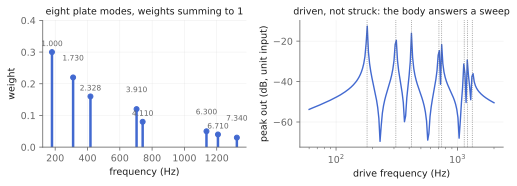
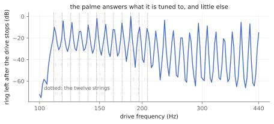

# Loudspeakers you can play

The Ondes Martenot does not have a loudspeaker. It has a rack of them, and
the player chooses. Beyond the plain cabinet — the *principal* — Maurice
Martenot built resonating **diffuseurs** whose entire job is to colour the
signal with a physical body: the **métallique** (1944–45, patented 1947), a
gong driven by a motor transducer, and the **palme** (1949–50), an
electromagnet driving twelve metal strings stretched on a soundboard.

`tap.metallique~` and `tap.palme~` are those two, and they ship as
standalone effects rather than as something hidden inside `tap.ondes~`,
because the interesting thing about a resonating loudspeaker is that it does
not care what you put through it. A guitar into the palme is not what
Martenot had in mind and it is the best reason to have the object.

Najnudel, Hélie, Roze and Boutin (IEEE/ACM TASLP 28, 2020) name the
diffuseur as the stage that "converts the electrical waveform into sound and
in turn modifies its spectral content". Wijnand, Boutin, Jossic and Maniguet
(Forum Acusticum 2023) describe the instruments and measure the transducer.
Everything below traces to one of those two, or is labelled as a
recreation.

Companion material: the executed notebook `diffuseur.ipynb`,
`tests/diffuseur_test.cpp`, and the `radiohead_render` scenes
`metallique_stages` and `palme_halo`.

## Driven, not struck

`tap.chime~` and `tap.garden~` already carry this library's modal machinery
— mode ratios, doublet splitting, per-mode decay — and it carries over here
intact. What does *not* carry over is the strike. There is no trigger in
either of these objects and no decay envelope. A diffuseur is excited
continuously by whatever is going through it and rings at its own rates,
which is `tap.5comb~`'s sustained-resonance situation rather than the
chime's.

Practically, that is the difference between an object you fire and an object
you feed.

## The order is the argument

The electrical signal reaches the *transducer* first, and the transducer's
motion is what excites the body. So the nonlinearity sits **upstream** of
the resonator. Drive the transducer hard and you are pushing a distorted
waveform into a gong — which is a different sound from distorting a gong.

That claim is pinned rather than asserted: a null test in the kernel checks
that a whole cabinet is *bitwise* identical to `transducer → body` wired by
hand, and that the reverse wiring differs by 28 % of peak. It is not a
subtlety you have to take on faith, and it is not a subtlety you can hear
your way past.

## The métallique

Eight modes at the free circular plate's transverse ratios — Rayleigh's
classical Chladni set at Poisson 0.3, `1 : 1.730 : 2.328 : 3.910 : 4.110 :
6.300 : 6.710 : 7.340` — each split into a slowly beating doublet.

*Left: where the modes are. Right: the body answering a sweep, which is how you actually meet it.*

`pitch` places the lowest mode and the rest follow. `decay` is the
fundamental's T60 — long is a drone, short is a plate reverb. `tilt` decides
how much faster the upper modes die than the fundamental, and `brightness`
weights them. The weights sum to exactly 1 and each mode has unit peak gain,
which is why there is no limiter on the output and no DC blocker either: the
body is bounded by its input, by construction.

## The palme

Twelve strings, each a damped delay loop, on one board.

Twelve, not twenty-four. Widely copied build pages say two banks of twelve;
the peer-reviewed source says twelve, and this object follows the
peer-reviewed source.

Their *tuning* is not published anywhere found, so it is a control: `@tuning
0` lays them out chromatically across an octave from `root` — a string for
every pitch class, so the board answers whatever you play — and `@tuning 1`
puts the harmonic series on the root, which is a drone that answers one key.

*Feed it a tone, take the tone away, measure what is left. Every one of the twelve strings rings at least 4.4× harder at its own pitch than between them.*

`damping` is how fast a string loses its upper partials — low values are
felt cloth on the strings. `detune` scatters the strings against each other
by a fixed, deterministic amount in cents, because no two strings on a real
board are in perfect relation.

## The transducer

Wijnand et al.'s point about the early diffuseurs is that they use a
**moving-iron** driver whose operating principle is inherently nonlinear —
Thiele–Small does not describe it — so a diffuseur modelled as a pure
resonator is missing a documented stage.

What is modelled here is that principle, not a fit to a measurement. In a
moving-iron motor the force follows the square of the gap flux, so with a
bias current `I₀` and signal `i` the force carries a term in `(I₀ + i)²`
whose residual `i²` makes second-harmonic distortion that grows with drive.
That is `asymmetry`: the transducer's own even-harmonic signature, and the
only part of these objects that is nonlinear by citation.

`saturation` is the honest exception. A squared law is expansive and
something has to bound it, so there is a soft clipper after it — a
**modelling necessity, not a measured stage**, and its coefficient is a knob
rather than a number from a paper. At 0 it is exactly linear.

## What these are, and are not

The instruments, their dates, their excitation and their transducer type are
peer-reviewed. **The modal data is not.** No ondes-specific measurement of
either body exists in any source obtained, so the plate comes from Fletcher
& Rossing's free circular plate and the strings from the harmonic series.
Both bodies are therefore **recreations of the general physics, not models
of Martenot's instruments**. Nothing here was fitted to a recording, a
measurement, or a photograph.

There is also no radiation model — no directivity, no cabinet, no soundboard
resonance of its own. The output is the body's modal response, not a room.
And the strings are ideal: a real steel string is stiff and its partials
stretch sharp, and that dispersion is not modelled. `detune` scatters
strings against each other, which is a different thing and does not stand in
for it.

## Recipes

- **A guitar into the palme:** `tap.palme~ @root 110 @tuning 0 @decay 8
  @mix 45`. The halo underneath everything you play. The reason these ship
  standalone.
- **The instrument, assembled:** `tap.ondes~` → `tap.palme~ @mix 60`. What
  Martenot actually had.
- **Gong reverb:** `tap.metallique~ @pitch 180 @decay 1.5 @tilt 1.2
  @mix 35`. Short decay turns the body into a plate.
- **A drone you drive:** `tap.metallique~ @decay 20 @drive 3 @asymmetry 0.5
  @saturation 0.4 @mix 100`. Hard into the transducer, which is upstream, so
  it is a distorted waveform ringing a gong rather than a distorted gong.
- **The one to be careful with:** `tap.palme~ @level` — twelve resonant loops
  add up, and a driven board can be much louder than what went into it.

## When it is not the right tool

- **A reverb.** These are twelve strings and eight modes. They are pitched,
  and they will impose their pitches on anything you send.
- **A model of Martenot's own diffuseurs.** See above: this is the physics
  of the general case, and the difference is stated rather than glossed.
- **Clean sustain.** `tap.5comb~` is the sustained-resonance object without
  a nonlinear driver in front of it.

## Checkpoint

Two loudspeakers with bodies, shipped as effects because a resonating
cabinet does not care what drives it. Driven rather than struck, so no
trigger and no envelope. The transducer is upstream of the body and a
bitwise null test pins that it is — 28 % of peak says the order is audible.
Every mode has unit peak gain and the weights sum to 1, so the body needs no
limiter. And the bodies are recreations of published physics rather than
measurements of Martenot's instruments, which is a limitation stated here
and in the header rather than left to be discovered.
