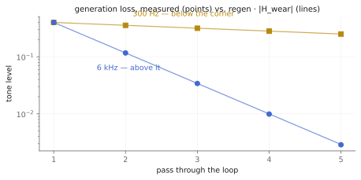

# The tape that forgets slowly

Every other delay in this house is kept honest by a cap: feedback stops just
short of one, because a loop that gains nothing and loses nothing will pile
up until it clips. `tap.discreet~` is built on the opposite bargain. Its
regeneration goes all the way to 1.0 — legally, cleanly, forever — because
the loop *forgets*: every pass through the tape comes back a little darker
and a little softer than it went in. The memory loss is not a defect the
kernel tolerates; it is the mechanism that keeps the machine stable. You are
not patching a delay effect. You are renting a machine whose memory is the
instrument.

The rig it recreates is printed on the back cover of *Discreet Music*
(Obscure/EG, 1975): Brian Eno's synthesizer feeding one Revox tape machine,
the tape spooling for seconds across the room to a second machine, and the
second machine's playback both sent to the speakers and folded back into the
first machine's record head. It is the same two-machine system Robert Fripp
ran for the *No Pussyfooting* loops. The tape path itself — the fractional
read, the periodic wow and flutter, the in-loop coloration — follows the
published tape-echo modeling literature (Arnardóttir, Abel, and Smith's AES
model of the Echoplex, and Välimäki et al.'s tape-echo work). The schematic
is the score; this kernel is a faithful performance of it.

Companion material: the executed notebook `discreet.ipynb`, which measured
every claim below, and the `eno_render` tool, whose `discreet_basic` and
`discreet_sustain` scenarios are the listening copies. The Max wrapper lands
in the TapTools-Max package alongside the rest of the family.

*Two machines and a spool of tape; the red return is where the forgetting — and therefore the stability — lives.*

## `loop` — the tape span

`loop_seconds` is the distance between the machines: how long a phrase
travels before it returns. The kernel test pins the grid to the sample — an
impulse comes back at exactly one loop, bit-for-bit the first time, and
every later return lands within a sample of its grid point.

Changing the loop while audio runs is a tape-speed change, not a menu
option: the read head physically glides to its new distance, and gliding a
read head *is* doppler. Move from 0.5 s to 0.75 s over half a second and the
playback drops an octave while the transport re-spools, then re-locks on
pitch — the test measures 220 Hz mid-glide and 440 Hz within five cents
after. There is no crossfading "digital" mode, on purpose. If a pitch bend
on loop changes would ruin the patch, this is the wrong delay (see below).

## `regen` — and why 1.0 is legal here

`regen` is the return level into the record head, and unlike `tap.delay~`'s
feedback (capped at 0.99), it reaches exactly 1.0. The notebook plays a
one-second noise burst into the loop at regen 1.0 and lets it run for twenty
seconds: the level settles and stays — no growth, no collapse — because the
wear path bounds it. The saturator's output can never exceed 1/drive
regardless of what the loop accumulates, the DC blocker keeps offsets from
stacking, and the darkening lowpass decides *what* survives: lows sustain,
highs surrender. The pinned scenario is blunt about the contract — it
asserts *non-growth*, never decay, because at regen 1.0 sustain is the
promise. Bring `regen` down, or darken harder, to end a piece; `clear` is
the eject button, and regen-1.0 material is gone for good.

## `darken` and `drive` — the wear

`darken_hz` is the record/playback corner: every pass through the loop runs
through a one-pole lowpass at this frequency, so a bright phrase sheds its
treble generation by generation while its body lingers. This is measured,
not vibes: with the corner at 2 kHz, a 6 kHz tone loses to 0.292 of itself
per pass and a 300 Hz tone keeps 0.890 — and both numbers match the analytic
transfer of the wear path to three decimals in the executed notebook.

*Generation loss, measured against `regen · |H_wear|`. The tape forgets treble first.*

`drive` is the record-head saturation — the guarantee. At any drive above
zero the loop is absolutely bounded no matter the settings; at drive 0 the
path is exactly linear (a real bit-for-bit passthrough, not "almost") and
the loop leans on darkening alone. Drive around 0.5 is the tape sound;
drive high is the loop slowly compressing itself into a wash.

## `wow` and `flutter` — the transport

Two sines, slow-deep and fast-shallow, breathing the play head's position.
The pitch math is honest and checkable: depth times 2π times rate is the
peak deviation, so 2 ms of wow at 0.5 Hz predicts ±10.9 cents — and the
notebook's YIN pitch track measures 10.9. The transport is periodic and
deterministic by design (no stochastic capstan drift): two renders of the
same settings are bit-identical, which is also a pinned test. Set both
depths to 0 for a perfectly still machine.

## `input_level` — the performance move

The fader Eno actually rode was not the output — it was the *send*. Play a
few phrases into the machine, then bring `input_level` to zero: the loop
keeps unrolling everything it holds, worn a shade further every pass, and
the piece continues without you. That gesture — set up a system, feed it,
step away — is the whole record, and it is one setter here. `mix` is the
ordinary equal-power dry/wet with bitwise-exact endpoints.

## Recipes

- **The Discreet Music bed:** `@loop 5. @regen 0.95 @darken 3500 @drive
  0.4 @mix 60`. Play sparse, slow phrases; stop; listen to what the tape
  decides to keep.
- **Frippertronics:** `@loop 6.5 @regen 1. @drive 0.7 @darken 2200 @mix
  100`. Solo over yourself from a minute ago. The wash never clips and
  never ends until you end it.
- **Haunted slapback:** `@loop 0.15 @regen 0.85 @wow 4. 0.9 @flutter 0.15
  12.` — a short loop with a seasick transport; the doppler and the wear
  turn a slap delay into a memory of one.
- **The exit:** whatever is running, ride `@regen` from 1. to 0.7 over a
  minute. The piece performs its own fade, oldest material first.

## When it is not the right tool

- **Rhythmic delays.** Loop changes bend pitch by design, and there is no
  tempo sync. `tap.delay~` is the clean line; `tap.multitap~` is the
  pattern.
- **Anything that must not color the repeats.** Wear is always in the loop
  (drive 0 removes only the saturation, not the darkening you set). If the
  tenth echo must equal the first, this machine is philosophically opposed.
- **Loops that should line up with other loops.** One machine, one spool.
  For a bank of independent free-running loops, the next chapter's
  `tap.airport~` is the instrument.

## Checkpoint

Seconds of tape between two machines; a worn return path — darken, saturate,
DC-block — instead of a feedback cap; regeneration to exactly 1.0 because
forgetting is the stabilizer. Loop moves are honest tape-speed doppler, the
transport is two deterministic sines measured in cents, and the send fader
is the performance. Every number above lives twice: as an executed cell in
`discreet.ipynb` and as a pinned scenario in `tests/discreet_test.cpp`,
which CI runs on every push.
