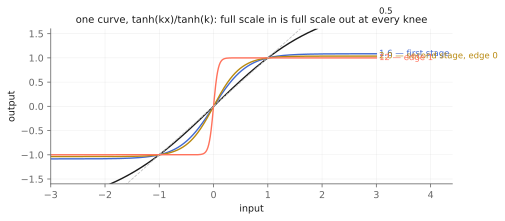
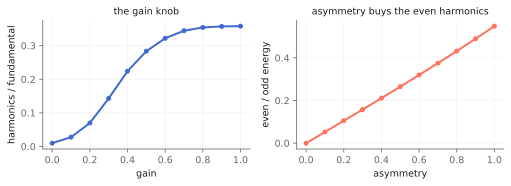

# The dirt with two stages

Two objects in this library make things dirty and they are not competing.
`tap.overdrive~` is a *feedback* soft-clipper chasing the Tube Screamer
lineage — the nonlinearity sits inside a loop with a lowpass, so the bass
stays clean and the mids break up first. `tap.fuzz~` is the other school:
two clipping stages one after the other, and a tone section that scoops the
middle out. It is the OK Computer-era sound — the dirt on *Paranoid Android*
and *My Iron Lung* — and it belongs in this part of the book because, like
the tape echo and the stutter, the interesting settings are the ones you
arrive at by moving something.

The method is not invented here. It is the **simplified cascade** of Yeh,
Abel and Smith's DAFx-07 paper on distortion and overdrive pedals:
conditioning filter → memoryless nonlinearity → equalization filter, twice.
That paper also supplies the licence for the central shortcut. A real diode
limiter is not a static curve at all — it is a lowpass whose pole moves with
the voltage across it, and solving that honestly is expensive. Approximating
it as a fixed curve between fixed filters is defended there, and measured
against real pedals.

What this object is *not* is a model of a specific pedal. No resistor,
capacitor or corner frequency in it is claimed as measured from a unit, and
the control names follow the layout that class of pedal conventionally
carries rather than asserting what any particular one does.

Companion material: the executed notebook `fuzz.ipynb`, and the
`radiohead_render` scenarios `fuzz_gain_sweep`, `fuzz_tone` and
`fuzz_edge_and_bite`.

## One curve, two knees

Both stages share a single clipping family — `tanh(kx)/tanh(k)` — normalized
so that full scale in is full scale out at *every* knee. That normalization
is what lets the knee be a character control instead of a hidden volume
control.

*The knee sharpens the corner without moving the ceiling.*

The first stage takes a soft knee and most of the gain (the op-amp-ish
stage); the second takes a harder one at unity (the shunt limiter). `edge`
sweeps the second stage's knee from a gentle limiter toward something close
to a hard corner.

## `gain` — and why the floor is below unity

The knob sweeps the first stage's drive. Its floor sits *below* unity
deliberately, and the reason is the most useful thing in this chapter if you
ever build a cascade of your own.

The tanh family's small-signal gain is `k/tanh(k)` — greater than one, and
growing with the knee. Put a fixed ×2.2 in front of a knee-3 curve and the
second stage sees an effective ×6.6, which means it is fully clipped before
the gain knob leaves zero. That is exactly what the first version of this
kernel did. It sounded like a distortion at every setting, which is precisely
why listening did not catch it and a measurement did.

*Left: the gain knob after retuning — harmonic content sweeps 0.010 to 0.358. Right: `asymmetry` is what makes even harmonics.*

## `asymmetry` — the even harmonics

A symmetric curve is an odd function, so it can only make odd harmonics.
DAFx-07 points out that a real op-amp stage clips lopsided, and that this is
where a pedal's even-order content comes from — which is the whole reason
this control exists. Turn it up and the even/odd ratio climbs from
essentially zero to about 0.55.

It costs no DC. The bias is applied inside the curve and corrected at the
stage output, so however lopsided the setting, silence in is *exactly*
silence out — no pedestal, no thump when you stop playing.

## `bass`, `treble`, `contrast` — the voicing

Three linear filters entirely outside the nonlinearity: a low shelf, a high
shelf, and a mid scoop whose depth is `contrast`. On this class of pedal the
voicing section is most of the identity — the scoop is the sound people mean
when they describe it — so it is a first-class part of the object rather
than an afterthought bolted on at the end.

## `oversample` — where 2 beats 8

A static curve makes harmonics without limit, so anything above Nyquist folds
back. The clipper pair therefore runs oversampled. Two things about the
setting are worth knowing, and both are measurements rather than opinions.

First, the anti-alias filter here is **8th order**, where the rest of the
house uses 4th. Measured in this kernel the 4th-order pair is not steep
enough — alias energy at 4× came out worse than at 2×.

Second, and more surprising: **bigger is not better**. Fold energy measures
1.2e-1 / 2.7e-5 / 7.4e-4 / 1.8e-3 at 1× / 2× / 4× / 8×. Every factor is worth
having over none — 2× alone is four orders of magnitude — but the sequence is
not monotone, and 2× wins. That is why the default is 2 rather than the
largest available number. The cause is genuinely open: the obvious suspect
(filters going ill-conditioned at the very low normalized cutoffs a high
factor needs) was tested and ruled out, and the untested candidate is
imaging from the zero-stuff upsampler intermodulating in the clipper. The
appendix says more.

Use a higher factor if a specific patch measures better there. Do not assume
it will.

## Recipes

- **Edge of breakup:** `@gain 0.3 @edge 0.2 @contrast 0. @bass 0.`. Barely
  dirty; a boost with attitude.
- **The scoop:** `@gain 0.8 @edge 0.6 @contrast 1. @bass 0.4 @treble 0.2`.
  The sound the control is named for.
- **Lopsided and mean:** `@gain 0.9 @edge 1. @asymmetry 0.7 @oversample 8`.
  Hard knee plus even harmonics; the one setting where a bigger oversample
  factor is worth auditioning.
- **Into the echo:** `tap.fuzz~` → `tap.tapecho~` with the echo's `@drive`
  low. Two saturators in series get muddy fast; let the pedal be the dirt and
  the tape be the space.

## When it is not the right tool

- **Amp-like breakup.** `tap.overdrive~` keeps the bass clean by design; this
  object does not, and hard settings will get woolly on a bass-heavy source.
- **Subtle warmth.** Two stages is a lot of stages. At low gain this is a
  clean boost with a tone stack, which is fine, but `tap.overdrive~` is the
  better instrument for gentle.
- **A specific pedal.** This is that pedal's *class*. If you need a named
  unit, this is not it and does not pretend to be.

## Checkpoint

One clipping family with a knee control, cascaded twice, into a voicing
section that scoops the middle. The gain knob's floor is below unity because
small-signal gain compounds through a cascade — a lesson that cost this
kernel one wrong first draft. `asymmetry` is the even-harmonic control and
costs no DC. And the oversample setting is a measurement, not a
bigger-is-better dial: 2× is the default because 2× wins. Every number here
lives twice, as a cell in `fuzz.ipynb` and as a pinned scenario in
`tests/fuzz_test.cpp`.
