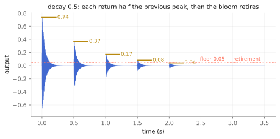

# The garden that plays itself

The first two chapters of this part recirculate sound: tape that forgets,
loops that never agree. This one recirculates *decisions*. Plant a note and
it comes back every pass of the loop a step quieter and a step purer, until
it fades below hearing and retires. Plant several and they braid. Stop
planting altogether and, after a patient interval, the garden starts
planting for itself — always on the scale, never in a hurry. You do not
play this instrument so much as tend it, which is exactly the posture Eno
kept asking for: the composer as gardener, not architect. The kernel is
named for that metaphor.

What it recreates is the *principle* behind Brian Eno and Peter Chilvers'
generative apps (Bloom, 2008), as described in their published interviews
and in Eno's 1996 "Generative Music" talk: touch becomes note, note repeats
and fades, scale makes wrong notes impossible, idleness hands the piece to
the system. The principle only — no scale tables, timings, or sounds are
taken from the app, and its name is a live trademark of Opal Limited, which
is why this object is a garden and not a bloom. (As with `tap.tune~`'s
history paragraph, none of this is legal advice; the project's ship-gate is
a freedom-to-operate review.)

Companion material: the executed notebook `garden.ipynb`, which measured
every claim below, and the `eno_render` tool's `garden_played` and
`garden_idle` scenarios, the listening copies. The Max wrapper lands in the
TapTools-Max package alongside the rest of the family.

*Events on a loop instead of audio on a tape — the same recirculation, one level of abstraction up.*

## Plant and return

`note(pitch, velocity)` plants: the pitch snaps to the current root and
scale *at entry*, a soft two-operator FM bell sounds on the next sample,
and the event takes a seat at the loop's current position. Every pass, it
fires again at `velocity × decay`, and below `floor` it retires. The
notebook's staircase is the whole contract in one figure: a plant at 0.8
with decay 0.5 returns at 0.795, 0.399, 0.2, 0.1, 0.05 — then silence, and
`active_events` reads zero.

*The return staircase: decay 0.5, floor 0.05, and a bloom that knows when it is finished.*

That arithmetic is also the stability story. The family's inversion —
degradation as the stabilizer — reaches its third form here: a bloom lives
exactly `ceil(log(floor/velocity) / log(decay))` passes, so the population
of live events *converges by construction* no matter how fast you plant.
And beneath the arithmetic sits a hard bound: sixteen bells in a fixed
pool, the quietest stolen when a seventeenth is needed, its envelope
re-aimed rather than reset so a steal glides instead of clicking.

## `soften` — returns get purer, not just quieter

Each pass also multiplies the event's *brightness* by `soften`, and
brightness is the bell's FM index: the upper partial fades while the
fundamental holds, so a bloom collapses toward a sine as it recedes — the
tape chapters' generation loss, restated in partials instead of passbands.
The notebook measures the sideband-to-fundamental ratio shrinking every
single return, and the pinned test requires it strictly.

## The scale contract

`root` and `scale` (chromatic, major, minor, and both pentatonics — plain
public-domain scale theory) define where plants may land, and quantization
happens at entry: the notebook plants all thirteen chromatic pitches from
60 to 72 into a C major-pentatonic garden and the YIN oracle reads every
sounded note on {C, D, E, G, A}. Wrong notes are not discouraged; they are
unrepresentable, which is most of why instruments in this family feel
effortless to strangers. Because quantization is at entry, changing the
scale re-pitches nothing already planted — the field changes for future
seeds only.

## The gardener

`idle_seconds` is the patience: that long after your last plant, the
garden begins seeding itself, roughly one note per loop pass, uniformly
placed, on the scale, within two octaves. The randomness is the family's
seeded xorshift64* with the full tr808 contract, pinned as a triad: same
seed, bit-identical garden; different seed, a different garden; gardener
disabled (`idle_seconds 0`), the seed cannot matter at all, because the
generator is never consumed. This is the library's first randomized event
source — `step_seq.h` proudly promises "no randomness anywhere" — and the
seed contract is what lets a generative instrument live in a test suite
that demands reproducibility.

## Recipes

- **The lobby:** defaults, `@idle 30. @level 0.4`, plant four or five
  notes, walk away. The garden holds the room indefinitely, bounded.
- **The music box:** `@decay 0.5 @soften 0.7 @idle 0 @bell 0.005 0.8 1.` —
  no gardener, fast decay: each phrase you play unwinds itself to silence
  in a few passes, a wind-up toy running down.
- **The endless install:** `@scale minorpentatonic @root 2 @idle 3.
  @seed 2008 @level 0.35`, never touch it again. Same seed next year,
  same garden.
- **Duet:** `@idle 6.` and stay at the keyboard — every silence longer
  than six seconds, the gardener answers you; every plant of yours resets
  its patience.

## When it is not the right tool

- **Melodies with wrong notes in them.** Quantization is always on;
  chromatic passing tones survive only in `@scale chromatic`, and
  micro-tonal pitches not at all. This is a fence, and it is the product.
- **Rhythm.** Events return on the loop grid, exactly, forever — no swing,
  no humanization. For patterns as *rhythm*, `tap.808.seq~` is the
  machine.
- **Any other timbre.** One soft bell family, on purpose. It is an
  instrument, not a polysynth; for FM as a playground, patch oscillators.

## Checkpoint

Notes become events; events recirculate on a loop, quieter by `decay` and
purer by `soften` each pass, retiring below `floor`; a sixteen-bell pool
bounds the sound and a sixty-four-seat ring bounds the score, oldest bloom
yielding first. The scale makes wrong notes unrepresentable, and a seeded
gardener keeps the piece alive exactly as long as you neglect it. Every
number above lives twice: as an executed cell in `garden.ipynb` and as a
pinned scenario in `tests/garden_test.cpp`, which CI runs on every push.
