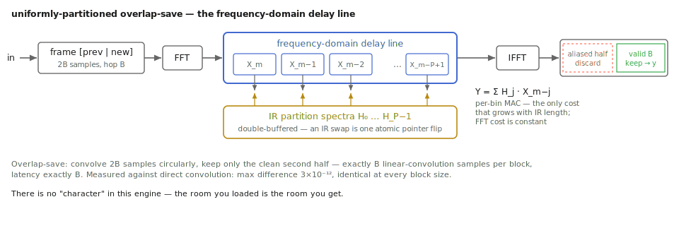

# Convolution without compromise: `conv_engine.h`

The user-facing chapter ([Borrowed rooms](../convolve.md)) made a flat claim:
`tap.convolve~` is **exact** — not "high quality," exact — and its only cost
is a latency of precisely `blocksize` samples. Claims like that are either
algebra or advertising. This appendix does the algebra: why the convolution
is partitioned at all, why overlap-*save*, why the latency is exactly one
partition, and how an impulse response can be replaced mid-performance
without the audio thread ever seeing a torn table.

## Why partitioned: the cost triangle

Direct convolution of a stereo pair against an L-second IR at rate fs costs

```text
cost_direct = L·fs MACs per output sample per path
```

— 48 000 multiply-adds per sample for one second of room at 48 kHz, times
four paths for true stereo. Untenable. The classical fix is to convolve in
the frequency domain: transform the whole IR once, multiply spectra, invert.
But a single-FFT scheme cannot emit anything until it holds a full frame of
input, so its latency equals the IR length — seconds of delay for a reverb.
Also untenable.

Uniform partitioning takes the middle of the triangle. Split the IR into P
equal partitions of B samples, `h_j[k] = h[j·B + k]`; then by linearity

```text
h = Σ_j h_j delayed by j·B
```

Each partition is short enough that its convolution can be computed with a
small FFT once per B-sample block, and the delays `j·B` are whole blocks —
which, we will see, cost nothing but indexing. FFT economics, latency of one
partition. This is the standard engine of the genre for a reason.

## Overlap-save: the framing, derived

The engine convolves each partition by circular convolution over an FFT of
size `m_fftsize = 2·m_block` — size 2B for partition size B. Circular and
linear convolution are not the same thing; the design question is which
output samples of the circular product are *also* the linear ones.

Take the frame the code actually builds in `process_block()`:

```text
frame_m = [ block_{m−1} ; block_m ]        (m_fre[j] = m_prev[ch][j]; m_fre[B+j] = m_inblk[ch][j])
```

and a partition h zero-padded from B to 2B. The circular convolution is

```text
y_circ[n] = Σ_{k=0}^{B−1} h[k] · frame[(n − k) mod 2B]
```

For n in the **second half**, n ∈ [B, 2B), and k < B, the index n − k stays
in [1, 2B): the `mod` never wraps, so `y_circ[n]` equals the *linear*
convolution of h with the input stream at that time. For n < B the mod does
wrap, splicing in samples from the frame's far end — time aliasing. So each
2B-point product yields exactly B valid samples, the second half, and the
code keeps precisely those:

```text
m_outblk[oc][j] = m_are[m_block + j];   // overlap-save: discard the aliased first half
```

That is the whole scheme: hop by B, keep the clean half, *discard* the dirty
half. The alternative, overlap-add, zero-pads each input block instead and
sums overlapping output tails — equally exact in theory, but it carries a
partial-sum accumulation buffer across block boundaries, one more piece of
state to get right. Overlap-save's output block is finished the moment the
IFFT returns: no summation state, no output windowing, no crossfading —
there is nothing between the IFFT and the output buffer that could be
inexact. Every step in the chain — framing (a copy), FFT and IFFT (the
shared radix-2 in `fft.h`, whose inverse divides by N so a round trip
reconstructs its input), and the multiply-accumulate — is exact linear
algebra in double precision. The engine has no tuning parameters that trade
accuracy for speed; its error budget is rounding noise, and the measurements
below confirm that is all there is.

## The frequency-domain delay line



*Why FFT cost is constant in IR length: the transforms bracket the structure, and only the MAC sees the partitions.*


The delays `j·B` remain. Delaying partition j's contribution by j blocks is
the same as convolving it with the input from j blocks *ago* — and the frame
for block m − j has already been transformed. So the engine keeps a ring of
past input spectra (the FDL, `m_fdl_re`/`m_fdl_im`, one per input channel)
and forms the output spectrum as

```text
Y_m[k] = Σ_{j=0}^{P−1} H_j[k] · X_{m−j}[k]
```

which is exactly the inner loop: `slot = cur − p` (mod `m_max_parts`), then
a complex multiply-accumulate over all `m_fftsize` bins into
`m_are`/`m_aim`. The consequence for cost is the design's payoff: **one
forward FFT per input channel and one inverse FFT per output channel per
block, regardless of P.** Growing the IR grows only the MAC. Per output
sample, the MAC costs P·2B complex MACs / B samples = 2P complex MACs ≈ 8P
real multiplies per path, versus P·B real MACs for direct convolution — a
factor of B/8 (64× at B = 512), with the FFTs an O(log B) constant on top.

## Latency is exactly B, by the framing

Follow one sample through `process()`: it is written into `m_inblk` at
position `m_pos`, and the *output* handed back at that same call is read
from `m_outblk[m_pos]` — a block computed when the *previous* block
completed. When block m finishes, `process_block()` runs with a frame ending
at the newest sample, and its B valid outputs are the linear convolution up
to that sample; they are then dealt out during block m + 1. So output sample
t carries y(t − B): the first partition's contribution to a block is
computed from the block just gathered, not from anything older, and the
delay is one partition — no more (the frame includes the newest sample) and
no less (nothing can be emitted before a block is complete). The unit test
pins both edges: the first B output samples are silence (the pre-roll), and
an IR of δ at index 5 yields the input delayed by exactly B + 5. The
notebook verified the latency at B = 64, 256, and 1024 — always exactly B.

## Exact, measured

The notebook (executing the real engine through the C ABI) puts numbers on
"exact": against a direct time-domain convolution of the same IR —
24 000 samples, B = 512, 47 partitions — the maximum difference is
**3.13×10⁻¹²**. Across block sizes the outputs agree with the direct
reference to 2.27×10⁻¹³ / 1.17×10⁻¹² / 1.76×10⁻¹² (B = 64/256/1024), and
with *each other*, latency-removed, to **1.81×10⁻¹²** — the block size is a
CPU/latency dial with no audible existence. An impulse through the engine
reconstructs the loaded IR to **5.5×10⁻¹⁴**, and a synthetic 0.60 s-RT60
reverb measures back at 0.599 s. The unit test does the same job in CI with
independent per-path IRs, deliberately awkward 10-sample process chunks that
straddle block boundaries, and 10⁻⁹ tolerances.

## True stereo: four paths, two FFTs

A stereo room is a 2×2 linear system, and the engine runs all of it:

```text
out_l = in_l ∗ h_LL + in_r ∗ h_RL ;   out_r = in_l ∗ h_LR + in_r ∗ h_RR
```

with `path = in_channel·2 + out_channel` (0 = LL, 1 = LR, 2 = RL, 3 = RR).
The economics are better than 4× mono: the two input FFTs are shared across
all four paths, and each output channel needs one inverse — so a block costs
2 forward FFTs, 2 inverse FFTs, and 4 MAC passes. The notebook pins the
routing: an impulse into L only emerges on R at exactly the cross-feed
path's gain (0.600 expected, 0.600 measured) and, with the off-diagonal
paths silent, R stays at 0.0 — cross-terms cannot hide in each other. The
mapping from `buffer~` channel count to paths (4+ = true stereo, 2 = dual
mono, 1 = same room both sides) is wrapper policy; the engine only ever
knows four pointers, any of which may be null for a silent path.

## The atomic IR swap

Loading a room while the music plays is the one place this engine touches
concurrency, and it is confined to a single atomic. The IR tables are
double-buffered per path (`m_ir_re[path][slot]`, slots 0/1). `load_ir()` —
which runs off the audio thread; it is the expensive part, P analysis FFTs
per path — writes only the *inactive* slot, then publishes:

```text
m_slot_parts[inactive] = P;                          // written before the publish...
m_active.store(inactive, std::memory_order_release); // ...so (slot, P) stay consistent.
```

The perform loop does one `acquire` load of `m_active` per block. The
release/acquire pair means that if the audio thread observes the new slot
index, it also observes that slot's fully written spectra *and* its
partition count — slot and P travel through one atomic, so there is no
window where the loop MACs over half-written tables or over the wrong
number of partitions. Until the store, the loop reads the old slot, which
the loader never touches. The discipline is single-writer double-buffering:
publishes are serialized through the wrapper's message path, and the just
vacated slot is only rewritten by the *next* load.

Why does a swap settle in exactly one block? Because the FDL stores **input**
spectra, not output. The first `process_block()` after the publish already
renders the entire tail — all P partitions — from the new IR against the
existing input history; the only samples that differ from a
new-IR-from-the-start engine are the ones sitting in `m_outblk`, computed
just before the swap. The unit test pins the settling (output equals the new
IR's pure delay from shortly after the swap); the notebook pins it exactly:
**max |swapped − reference| after +1 block = 0.00×10⁰** — bit-identical to
an engine that had the new IR from the start — with RMS continuity across
the swap instant, **21.922 before, 22.147 just after**, no dropout. Honest
limit: the swap is a hard splice between two exact convolutions, click-free
but discrete; the engine does not interpolate between rooms.

A related freebie of the input-side FDL: analysis of incoming audio happens
*before* the has-IR check, so the delay line is warm even while no IR is
loaded — load the first room mid-stream and its tail renders immediately
from audio already played.

## The engineering ledger

- **Uniform, not Gardner non-uniform, partitioning.** Non-uniform schemes
  (short partitions first, growing later) can push latency below B for the
  same CPU, but they need multiple FFT sizes and a scheduler that spreads
  long-partition work across blocks — real complexity with real failure
  modes. The object's latency budget is satisfied by making B small (64
  samples = 1.3 ms, verified exact above); complexity was not bought that
  nothing needed.
- **The shared FFT.** `fft.h` is the in-house radix-2 Cooley–Tukey used by
  the whole spectral set; per its header it lived byte-identical inside
  `conv_engine`, `tap.nr~`, and `tap.spectra~` before being consolidated at
  the kernel split. In-place, forward unscaled, inverse divides by N —
  round-trip exact by construction. No external FFT dependency, per the
  porting philosophy.
- **IR stored as float32, deliberately.** A `buffer~` holds 32-bit samples;
  the engine quantizes at `load_ir` (`static_cast<double>(src[idx]) *
  scale`) and computes in doubles thereafter. The notebook's
  direct-convolution reference casts its IR through float32 the same way —
  so the 10⁻¹² figures isolate the *algorithm*, not the source quantization
  the wrapper inherits from Max regardless.
- **Geometry only in `configure()`.** Partition size and capacity determine
  every buffer, so reallocation happens only where the audio thread is
  idle — the wrapper calls it from `dspsetup`. `clear()` flushes running
  state with `std::fill` only, no reallocation, and is safe from a message
  handler; `process()` allocates nothing, ever (scratch spectra
  `m_fre`/`m_fim`/`m_are`/`m_aim` are preallocated and reused).
- **Capacity vs. length.** The FDL ring is sized `m_max_parts`; a loaded IR
  uses `P ≤ m_max_parts` partitions (`load_ir` clamps), and the MAC runs
  over P only — a short room in a big engine costs a short room.
- **The deferred optimization, on the record.** The spectra are stored and
  MAC'd full-complex; the input is real, so a half-spectrum (N/2 + 1 bins,
  Hermitian symmetry) form would halve both the MAC and the IR/FDL memory.
  The header flags it and parks it, under the same house rule the SVF
  appendix recorded: optimizations land bit-identical or explicitly signed
  off — and re-deriving the packing arithmetic is exactly the kind of change
  that gets signed off with a measurement, not slipped in.

## Checkpoint

Partitioning splits the IR by linearity; overlap-save framing makes each
2B-point circular product yield B exactly-linear samples with nothing to
window or crossfade; the frequency-domain delay line turns partition delays
into ring indexing, so FFT cost is constant in IR length and only the MAC
grows. Latency is one partition by the framing — measured at exactly B for
every B tried — and exactness is measured at 10⁻¹²-and-below everywhere it
can be probed. The one concurrent act, swapping rooms, rides a single
release/acquire atomic over double-buffered tables, and settles
bit-identically in one block because the delay line remembers input, not
output. The compromises the genre usually accepts — approximate tails,
block-size coloration, swap dropouts — are absent, and the measurements say
so.
