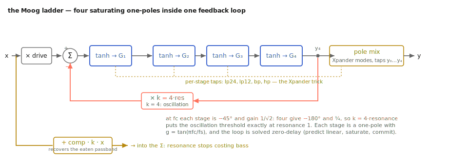

# The nonlinear loop: `ladder.h`

The user-facing chapter promised self-oscillation *in tune* (8009 Hz
measured for an 8 kHz cutoff), THD that walks from 0.5 % to 33 %, `comp`
recovering exactly the passband resonance eats, and a measured 13.5 dB
from oversampling. This appendix derives all of it. The
[SVF appendix](svf.md) built the trapezoidal machinery; here it is wrapped
in four tanh saturators and a feedback loop *supposed* to go unstable —
and the engineering is solving a loop that no longer solves on paper.

## The stage: one pole, trapezoidal, prewarped

Each stage is the analog one-pole lowpass y' = ω·(x − y), discretized with
the trapezoidal rule exactly as in the SVF. Once per cutoff change,
`update_derived` computes

```text
g   = tan(π · fc / fs_os)      the prewarped integrator gain
m_g = g / (1 + g)              the solved per-stage gain, G below
```

and the per-stage step (`tpt`) is the standard zero-delay one-pole:

```text
v = (x − s) · G        y = v + s        s ← y + v   (= 2y − s)
```

For a lone lowpass the `tan` prewarp is a nicety. Here it is the tuning
system: the filter's oscillation frequency is set by where the stages put
their phase, so pole mis-placement becomes pitch error — the failure of
the classic Stilson/Smith ladder in the top octaves.

## The loop: why the magic number is four

Four stages in series, global negative feedback: the stage-1 input is
`L − m_k·y4` (L the driven input, `m_k = 4.0 * resonance`). The 4 is the
linear loop's oscillation threshold. At the cutoff a one-pole has response
1/(1 + j): magnitude 1/√2, phase −45°. Four in series:

```text
|H⁴(fc)| = (1/√2)⁴ = 1/4        ∠H⁴(fc) = 4 · (−45°) = −180°
```

The input subtraction supplies the other 180°, so at fc — and only there —
the loop phase is 360°. Barkhausen: oscillation begins at unity loop gain,

```text
k · 1/4 = 1        ⇒        k = 4
```

So `resonance = 1.0` (k = 4) is the mathematical edge, oscillation happens
*at the tuned cutoff*, and self-oscillation frequency is the tuning test:
the notebook measures 1000.2 Hz for a 1 kHz cutoff (0.02 % error) and
8009.0 Hz for 8 kHz (0.11 %) — the prewarp holding at the top of the
keyboard, as promised.

The file allows `k_res_max = 1.1`, i.e. k = 4.4, "comfortably past
self-oscillation." Past the edge the linear model diverges — but as
amplitude grows, tanh's small-signal gain falls, the effective loop gain
sags back toward 4, and the oscillation parks where they balance: the SVF
driven circuit's fixed-point argument, no clipper needed. The notebook's
oscillation (resonance 1.08) peaks near |y| = 0.10; the kernel test holds
five seconds at k = 4.4 finite, under 2.0 peak, RMS steady within a
0.7–1.4× band. An all-zero state also solves the equations — hence the
header's advice to ping it.



*The file as a schematic: the Barkhausen condition lives at the red tap.*

## The algebraic loop, solved linearly first

Zero-delay feedback through four stages means y4 depends on the stage-1
input, which depends on y4. Linearly, substitution closes it: chain the
linear stage form y = G·x + B·s (B = 1 − G, s the held state) through all
four with u = L − k·y4,

```text
y1 = G·u + B·s1
y2 = G²·u + G·B·s1 + B·s2
y3 = G³·u + G²·B·s1 + G·B·s2 + B·s3
y4 = G⁴·u + G³·B·s1 + G²·B·s2 + G·B·s3 + B·s4
```

then name the state-only part S and solve:

```text
S  = G³·B·s1 + G²·B·s2 + G·B·s3 + B·s4
y4 = G⁴·(L − k·y4) + S        ⇒        y4 = (G⁴·L + S) / (1 + k·G⁴)
```

That last expression is `predict_linear` verbatim — the code's
`(G2*G2*L + S) / (1.0 + m_k*G2*G2)` with `G2 = G*G` and the same four-term
S over `m_s1..m_s4`. For the *linear* ladder it is exact — the four-stage
analog of the SVF's a1/a2 solve.

## The saturators, and the one-pass commit

With tanh in every stage, the honest loop equation y4 = F(L − k·y4) has
no closed form. The file ships two answers.

**`solver_fast` (default)** is Huovilainen-flavored prediction-correction:
compute `predict_linear(L)` as if the saturators weren't there, then run
the *saturating* stages once with that feedback value and commit (`core`):

```text
t0 = sat(L − m_k·y4_est)
y1 = tpt(m_s1, t0, G),   y2 = tpt(m_s2, sat(y1), G),   ... y4 likewise
```

The committed y4 is not the y4_est the feedback used — that mismatch is
the method's error. When the signal is small, tanh is the identity and the
prediction is *exact*: the linear filter is recovered in the limit. The
error grows only with how far tanh bends over one sample's state change —
so drive × resonance is the failure axis, and oversampling (2× default)
doubles as accuracy: it shrinks the per-step change being predicted.

**`solver_exact`** solves the true loop: Newton iteration on
F(g) = `y4_trial(L, g)` − g, where `y4_trial` evaluates the four
saturating stages for a guessed feedback value without touching state.
Seeded by the linear prediction, clamped to ±3 (a tanh-bounded loop cannot
park a fixed point far outside ±1), with a numerical derivative that falls
back to the seed if it degenerates, at most 12 iterations to a 1e-12
residual. The commit reuses the *same* `core` path — with the converged g
it reproduces the trial values while `tpt` advances the states. One code
path, two accuracies.

How different are they? The kernel test renders both at drive 3 dB,
resonance 0.5 and pins the maximum sample difference below 0.01; the
stress test (drive 24 dB, resonance 1.1, asym 1.0) asks only that
`solver_exact` stay finite and bounded. Audibly identical until drive
*and* resonance are pushed — and `solver_fast` costs one saturated pass
where Newton can cost dozens of trial evaluations per sub-sample.

## `asym`: moving the operating point

Real ladder transistors don't match, so real stages don't saturate
symmetrically. The model is an operating-point shift in every stage:

```text
m_sat_bias = 0.3 · asym
sat(v) = tanh(v + m_sat_bias) − m_sat_dc      m_sat_dc = tanh(m_sat_bias)
```

The subtraction keeps sat(0) = 0 exactly — silence in, silence out. Expand
tanh about the bias: a curvature term −tanh(b)·sech²(b)·v² appears only
when b ≠ 0, and a v² term generates second harmonic and DC. The notebook
measures the driven 2nd harmonic at −155.8 dB relative to the fundamental
at asym 0 (numerical noise — tanh is odd), rising to −18.6 dB at asym 0.6.
The DC is the rectifying side of the same v² term; the header owns it
honestly and delegates to `tap.dcblock~`. Drive's own numbers: THD
0.54 / 3.45 / 16.50 / 33.07 % at 0 / 8 / 16 / 24 dB (notebook) — odd
harmonics only, until `asym` says so.

## `comp`: the passband bargain, quantified

At DC every stage passes unity; the closed linear loop gives

```text
y4(DC) = L − k·y4(DC)        ⇒        y4(DC) = L / (1 + k)
```

Resonance eats the passband by exactly 1/(1+k). At resonance 0.9, k = 3.6:
predicted 20·log10(1/4.6) = −13.3 dB; the notebook measures −13.2 dB. The
compensation is a pre-gain (`update_derived`):

```text
m_in_gain = 10^(drive/20) · (1 + comp·m_k)
```

At comp = 1 the input is multiplied by (1 + k) and DC gain returns to
exactly unity — measured +0.0 dB — with a linear blend below. One honest
note: the compensation multiplies the input *before* the saturators, so
high comp at high resonance also leans harder on the tanh stages — like
turning up the level into hardware; authentic, not a linear post-trim.

## Pole mixing: the Xpander table

`core` returns a fixed weighted sum over the taps [t0, y1, y2, y3, y4]
(`k_c_mix`). In the linear small-signal limit each tap is a power of the
one-pole response H applied to u, so the mixes are polynomial algebra:

```text
lp12:  y2                        =  H²·u
hp12:  t0 − 2·y1 + y2            =  (1 − H)²·u        weights {1,−2,1,0,0}
hp24:  (1 − H)⁴                  →  {1,−4,6,−4,1}      alternating binomial
bp12:  2·(y1 − y2) = 2·H(1−H)·u  →  {0,2,−2,0,0}
bp24:  4·H²(1−H)²                →  {0,0,4,−8,4}
```

The binomial rows are literally (1−H)ⁿ expanded. The bandpass factors are
unity-gain normalizers: at fc, |H| = |1−H| = 1/√2 with phases ∓45°, so
H(1−H) has magnitude 1/2 and phase 0 — the 2 (and 4 for its square)
restore 0 dB at center. Measured high-side slopes: 23.4 dB/oct for lp24
(want 24), 11.7 for lp12 (want 12). Two caveats, both inherited from the
analog original: under saturation the taps carry distortion products and
the algebra is approximate (the header says so), and the feedback is
always the full four-pole loop — a "12 dB" mode is a two-pole *slope*
riding four-pole resonance, exactly as in an Xpander.

## Oversampling: paying for tanh honestly

tanh generates harmonics without limit; above Nyquist they fold back
inharmonically. `run` is the classic chain (the `tap.verb~` pattern,
self-contained per house rule): zero-stuff by the factor, scaling the
retained sample by `m_os` to preserve passband gain; 4th-order Butterworth
anti-imaging at 0.45 of the original Nyquist (fc_norm = 0.45/m_os); the
nonlinear `core` at the high rate; a matching anti-alias Butterworth;
decimation by keeping the last filtered sub-sample. Each Butterworth is
two RBJ biquads at the textbook Q pair 0.54119610 / 1.30656296 =
1/(2·cos(π/8)), 1/(2·cos(3π/8)). Measured on a hard-driven 5 kHz tone:
non-harmonic (alias) energy −30.1 dB at 1×, −43.7 dB at 4× — the promised
13.5 dB. The clamp `fc ≤ 0.49·fs_os` keeps 20 kHz legal at every factor.

## The engineering ledger

- **One derived tier, not two.** Unlike the SVF's split shape/cutoff
  caches, `update_derived` recomputes everything whenever anything moves
  (`m_derived_dirty` stays set while `m_ramps_active > 0`). Nearly every
  derived value reads several parameters (`m_in_gain`: drive, comp, *and*
  resonance) — a finer split buys little.
- **The signal-rate cutoff path re-dirties deliberately.**
  `process(x, cutoff_hz)` recomputes for the override, then sets
  `m_derived_dirty = true` — "the cached G belongs to the override, not
  the parameter" — so the message-rate path never serves a stale one.
- **Ramps everywhere, counted.** Every parameter rides a per-sample linear
  ramp (20 ms default); `m_ramps_active` makes idle one integer test. The
  kernel test bounds the worst sample jump through a 100 ms preset recall
  and a per-sample 500→6000 Hz sweep — click-free is asserted, not
  assumed.
- **Preset morph in the kernel.** 16 slots; `recall_preset` is `ramp_to`
  on all six parameters with a shared duration — as safe as any motion.
- **Anti-denormal on the stage states** (`anti_denormal`, the `tap.comb~`
  1e-15 idiom), inside `tpt` — a ringing-out filter otherwise decays into
  denormals and multiplies its own CPU cost.
- **Newton is guarded, not trusted.** Seed clamp, derivative fallback,
  iteration cap: `solve_exact` cannot NaN or hang, only degrade toward
  `solver_fast`.
- **Allocation-free after `prepare()`;** setters are plain stores into
  ramp targets, safe from the message thread while audio runs.

## Checkpoint

Four trapezoidal one-poles put −180° and gain 1/4 at the prewarped cutoff;
negative feedback makes k = 4 the oscillation threshold, which is why
`resonance` is calibrated in quarters of k and self-oscillation lands on
pitch (8009 Hz for 8 kHz, measured). The linear loop solves in closed
form; the saturating loop is predicted linearly and committed through the
tanh stages once — exact in the small-signal limit, backstopped by a
guarded Newton solver. `asym` shifts the tanh operating point, `comp`
pre-multiplies away the derived 1/(1+k) droop, the Xpander table is
binomial algebra over the taps, and the oversampling chain pays tanh's
alias bill with a measured 13.5 dB. Every number in the user-facing
chapter traces to a line in this file.
