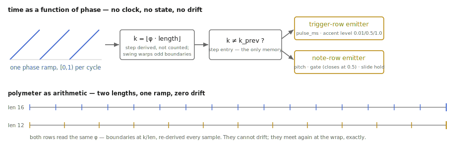

# Time as a function of phase: `step_seq.h`

The sequencer header is the smallest DSP file in the kernel and the one
whose central decision does the most work per line: **the engine owns no
clock**. It is handed a phase — a number in [0, 1) meaning "here is where we
are in the pattern" — and everything else (the current step, whether this
sample is a boundary, how far through the step we are) is *derived* from it,
statelessly, every sample. This appendix explains why that one decision
buys sample accuracy, polymeter, scrubbing, and drift-free multi-row lock
for free, and then walks the three pieces built on it: the swing warp, the
two emitters, and quantized recall.

Verification lives in two places:
[`tests/step_seq_test.cpp`](https://github.com/tap/TapTools/blob/main/tests/step_seq_test.cpp)
(19 Catch2 scenarios, including a pairing test against the real
`tb303_voice.h`) and the executed
[`step_seq.ipynb`](https://github.com/tap/TapTools/blob/main/notebooks/step_seq.ipynb).
The design of record is `plans/tap.seq.md` in the Max package repo.

## Deriving the step, in O(1)

Ignore swing for a moment and the whole clock is one line:

```text
k = floor( wrap(phase) · length )
```

Swing delays each odd-numbered step's start by `swing/2` of a step, so the
start of step k is

```text
start(k) = ( k + (k odd ? swing/2 : 0) ) / length
```

and the derivation gains one correction: compute the naive `k`, and if it is
odd but the fractional position hasn't yet reached `swing/2`, the sample
still belongs to the (even) step before it. Two comparisons, no search —
the boundaries are monotone, so the correction is exact.

A **step entry** is simply `k != k_previous`. That definition, rather than
"the clock ticked," is what makes the engine indifferent to how the phase
moves: run it backwards and entries still fire (pinned by test); jump it
and the landing step fires once; feed it a constant and nothing happens
after the first sample. `reset()` just forgets `k_previous`, so a transport
start fires its downbeat.



*The one decision the file turns on — and polymeter falling out of it as arithmetic.*

## Why phase, not a pulse clock

The alternative — count incoming clock pulses — is how most step sequencers
are built, and every one of them then grows a reset input, a position
protocol, and a drift story. Deriving from phase dissolves all three:

- **Sample accuracy** is inherited from the phase source. The notebook
  measures trigger edges landing within one sample of the analytically
  computed boundaries — the one sample being float rounding at the boundary
  itself, not accumulated error.
- **Multi-row lock is structural.** Two rows fed the same ramp *cannot*
  drift, because neither owns any timing state that could drift. Mute one
  for an hour; it re-enters in place.
- **Polymeter is arithmetic.** A `length 12` row against `length 16` rows
  off one ramp divides the same cycle differently — 12 and 16 entries per
  cycle, measured. The TR-808's triplet "pre-scale" falls out as a special
  case.
- **Position is explicit.** Scrubbing, reversing, and jumping are the
  *caller's* choices about the ramp, not features the engine implements.

The cost is honest too: the engine cannot free-run. That is deliberate —
`phasor~` (transport-locked or not) already exists, and a sequencer that
owns tempo is a sequencer that fights the transport.

## Position within the step, and the gate duty

The tick also reports `pos` — the fraction of the current step's *actual*
(swung) span elapsed — computed from the same `start()` function. Gate
timing hangs off it: the note row closes its gate at `pos ≥ 0.5`, the
pinned Open303 duty. Measuring duty against the swung span rather than the
nominal step means gates never collide however hard the swing is pushed.

## The trigger row: an impulse and a re-arming gap

`trigger_row` is the small emitter: on entry to a sounding step, emit the
step's velocity for one sample (or `pulse_ms` worth, for envelope
consumers), else zero. The single-sample default is a contract, not a
simplification: every downstream `tap.808.*` voice re-arms its edge
detector below 1e-3, and the test suite pins that two *adjacent* sounding
steps produce two clean detectable edges. The header documents the one way
to defeat this — a `pulse_ms` longer than a step merges back-to-back
triggers — rather than silently preventing it.

## The note row: a five-state sentence

`note_row` implements the tap.303~ contract, and its entire behavior fits
in one paragraph of code. On entering step k: if the step is gated and its
**slide** flag is set *and a note is already sounding*, change the pitch
output and leave the gate level alone — that is legato, and the voice's RC
does the glide. If gated without that condition, set the gate to 1.0 (2.0
if accented) — a fresh edge. If not gated, drop the gate. Between entries:
close the gate at the duty point *unless the next step is gated and
slid* — that look-ahead read is the gate-hold, and it is read live from the
pattern each sample so an edit lands immediately.

Three edge cases are worth naming because the tests pin them:

- **Slide from a rest is a plain trigger** — there is nothing sounding to
  slide from, so the flag degrades gracefully (the voice's `note` message
  behaves identically).
- **Chained slides chain** — each held boundary defers the duty close to
  the next step, so a run of slid steps is one unbroken gate. Sixteen gated
  steps with three slide flags produce exactly thirteen note-ons, measured.
- **The wrap is a boundary like any other** — a slide from step 15 into
  step 0 holds across phase 1→0, because nothing in the derivation treats
  the wrap specially.

One convention deserves its provenance note: the slide flag sits on the
*target* step (the note being slid into), matching the package's
`note <pitch> [accent] [slide]` message and the original interface dry-run.
The hardware stores the flag on the *source* note ("slide to next"). The
data models convert trivially — shift the flag column by one — and the
divergence is documented in the header rather than discovered by a user.

## Quantized recall: swap on the boundary sample

Patterns live in 16 slots. `recall` **arms** rather than acts (unless
`quantize now`): the armed slot is applied on the next cycle entry (step 0)
or step entry, and — the detail that keeps it exact — the engine then
*re-derives the current step against the new pattern's grid* on that same
sample, since the new pattern may have a different length. The notebook
pins the semantics end to end: armed mid-cycle, the running pattern
finishes its bar at its own amplitudes, and the first trigger after the
wrap carries the recalled pattern's. That one message is the TR-808's
A/B-half and basic/fill switching.

## What is deliberately absent

No randomness (bit-exact by construction, still pinned by test, because
invariants that aren't tested rot). No allocation after `prepare()` — the
pattern store is a fixed 64-step array times 16 slots. No run/stop, no
direction modes, no ratchets: the first two belong to the phase source, and
the last is a future emitter, which is the point of the next paragraph.

## The engineering ledger

- **Engine/emitter split.** The clock math lives once; `trigger_row` and
  `note_row` are each a screenful. A future row flavor — CV, probability,
  ratchet — is another emitter, not another clock. This is also why the
  Max-side question "one generic object or two family objects?" could be
  answered by product taste rather than by implementation cost.
- **Look-ahead vs. cached hold.** The gate-hold could cache "next step
  slides" at entry; reading it live costs one array access per sample and
  makes pattern edits take effect mid-step. Cheap beats stale.
- **Sample-resolution boundaries.** Sub-sample trigger placement (fractional
  edge amplitudes à la BLEP) was considered and declined: the consuming
  voices detect edges at sample resolution, so sub-sample machinery would
  add complexity no consumer can observe. If a future voice interpolates
  its trigger time, the `tick` already carries the information needed to
  add it.
- **The armed-recall re-derivation.** The subtle bug in naive quantized
  recall is applying the swap *after* deriving the step, leaving one sample
  computed against the old grid. Applying, then re-deriving within the same
  call, is two extra lines and the difference between "exact on the wrap
  sample" (measured) and "usually fine."

## Checkpoint

A sequencer that is a pure function of phase plus a pattern: one line of
derivation, one comparison for swing, entry as inequality — and from that,
sample accuracy, polymeter, reversibility, and drift-free lock without a
clock to maintain. The rows translate steps into the two shipped voice
contracts, with slide as a held gate and a live look-ahead; recall swaps
patterns on the exact boundary sample. Nineteen scenarios and an executed
notebook agree, and the most satisfying number in either is small: thirteen
note-ons, for sixteen steps, three of which arrived without knocking.
