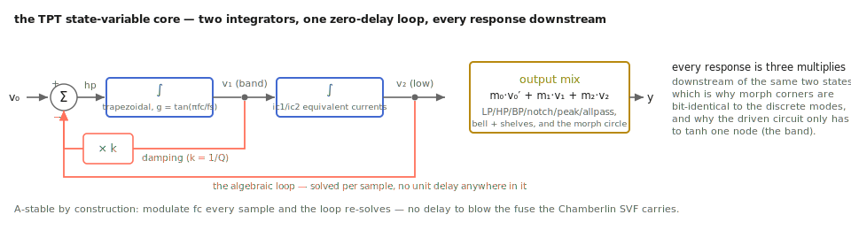

# Solving the filter on paper: `svf.h`

The user-facing chapter promised that `tap.svf~` is "unconditionally stable
under per-sample cutoff modulation" and that its morph corners are
"bit-identical to the discrete modes." Promises like that are either
mathematical facts or marketing. This appendix does the math: it derives the
filter the way the file was actually designed, then walks the engineering
decisions that don't show up in a Bode plot — and *why* each one beat its
alternative.

The reference is Andy Simper's Cytomic technical papers ("Solving the
continuous SVF equations using trapezoidal integration and equivalent
currents"), specifically the `SvfLinearTrapOptimised2` form. What follows is
the same derivation with the file's variable names.

## The analog prototype, and where digital versions go wrong

The state-variable filter is two integrators in a loop. With cutoff ω and
damping k = 1/Q, the continuous equations are:

```text
v1' = ω · (v0 − k·v1 − v2)     (band state: input minus damping minus low state)
v2' = ω · v1                   (low state: integral of band)
```

Lowpass is v2, bandpass v1, highpass v0 − k·v1 − v2 — every response lives in
the same two states, which is what makes an output *mix* (and therefore a
morph) possible at all.

The textbook digital version (Chamberlin) discretizes with explicit Euler:
each integrator uses the *previous* sample's value. That inserts a unit delay
into the loop, and a delay in a feedback loop is a stability bomb with a
frequency fuse: the design blows up as fc approaches fs/6, and modulating the
cutoff re-lights the fuse every sample. The classic workarounds (oversample
it, clamp it) treat symptoms.

## Trapezoidal integration, and the algebraic loop

The fix is to integrate with the trapezoidal rule — average the old and new
derivative — which in filter terms is the bilinear transform. Define the
prewarped gain the file computes once per cutoff change:

```text
g = tan(π · fc / fs)
```

(The tan is the prewarp: it makes the digital filter's response at fc exactly
match the analog prototype's, all the way to Nyquist. This single line is why
self-oscillation later measures 999.7 Hz for a 1 kHz setting rather than
drifting flat.)

Trapezoidal integration of state s with input x is s_new = s + g·(x_old +
x_new). Grouping the "old" terms into a memory variable — Simper's *equivalent
current* ic = s + g·x_old — each integrator becomes:

```text
s_new = ic + g · x_new         with ic updated as ic_new = 2·s_new − ic
```

But notice the trap: x_new for the first integrator is the *new* band value,
which depends on the *new* low value, which depends on the new band value. The
new sample appears on both sides — an algebraic loop, exactly the "zero-delay
feedback" the initials ZDF refer to. Instead of breaking the loop with a
delay (Chamberlin's sin), we solve it. It is linear, so substitution gives a
closed form. With v0 the input and ic1, ic2 the two equivalent currents:

```text
v1 = a1 · ic1 + a2 · (v0 − ic2)          the band state, solved
v2 = ic2 + g · v1                        the low state, then follows
where  a1 = 1 / (1 + g·(g + k)),  a2 = g · a1
```

Those are precisely the file's per-section solve constants (`a1`, `a2`, `a3 =
g·a2` caches the product used by the low state), and the state update is the
canonical TPT pair `ic1 = 2·v1 − ic1`, `ic2 = 2·v2 − ic2`.

**Why this is unconditionally stable, even modulated:** the trapezoidal rule
is A-stable — it maps the entire left half of the s-plane (every stable
analog filter) inside the unit circle, for *any* g > 0. Change g every sample
and each sample still computes a passive, energy-consistent step; there is no
regime of fc or modulation rate where the update gains exceed unity. The
notebook's 90 Hz-LFO-through-five-octaves torture test isn't surviving by
margin; it's surviving by theorem.



*The loop the algebra just solved, and the mixer the next section explains.*

## The output mix, and why morph corners cost nothing

Every response is a weighted sum over the same solved values:

```text
y = m0·v0 + m1·v1 + m2·v2

lowpass   m = (0,  0, 1)        notch     m = (1, −k, 0)
bandpass  m = (0,  1, 0)        peak      m = (1, −k, −2)
highpass  m = (1, −k, −1)       allpass   m = (1, −2k, 0)
```

`mode_morph` linearly interpolates the mix vector around the circle LP → BP →
HP → notch → LP. Two facts follow *by construction*, not by tuning:

- **At a corner, the interpolated vector equals the discrete mode's vector
  exactly** — same floats, same states, same arithmetic. The notebook's
  measured max difference of 0 is not a tight tolerance; it is an identity.
- **Morphing is free.** The states don't know the mix exists; sweeping it can
  never destabilize anything, because it is three multiplies downstream of
  the filter.

The parametric-EQ trio (bell, shelves) is the same machinery with mix weights
that depend on a gain factor A = 10^(dB/40), straight from Simper's tables —
and it always runs a single section, because cascading an EQ stage squares
its boost: two +12 dB bells are a +24 dB bell, which is never what the user
typed.

## The cascade: Butterworth spread, resonance on the last section

Orders 4 and 8 run two and four sections at the same cutoff. Stacking
identical Q = 0.707 sections would droop the passband (each contributes its
−3 dB early); instead the sections take the Butterworth Q spread — the Qs
whose product of section responses is maximally flat:

```text
Q_i = 1 / (2·cos θ_i),  θ_i the Butterworth pole angles
order 4: 0.5412, 1.3066        order 8: 0.5098, 0.6013, 0.9000, 2.5629
```

That is why the measured response sits at −3.01 dB at fc at *every* order.
User resonance then sharpens **only the final (highest-Q) section**, via

```text
Q_res = Q_base / (1 − r),  r ∈ [0, 1)   (clamped at 1 − 10⁻⁴)
```

— one clean resonant peak riding a flat passband, rather than four peaks
compounding. The inverse mapping (`resonance_from_q`) exists so the wrapper's
`q` message round-trips exactly.

## The driven circuit: one saturation, one pass

The driven circuit places tanh on the band node — in the damping path, where
an OTA's transconductance actually compresses. That placement is the whole
design: as amplitude grows, the effective damping k·tanh(v1)/v1 grows with
it, which is an automatic gain control wrapped around the resonance. Push the
loop gain slightly past the oscillation threshold at resonance 1.0 and the
filter must oscillate (the linear model's poles are outside the circle) but
cannot run away (the saturation restores effective damping as amplitude
rises). Bounded self-oscillation is not a limiter bolted on; it is the fixed
point of that tug-of-war. An all-zero state solves the equations too — hence
"give it a ping."

Solving a *nonlinear* zero-delay loop exactly needs iteration. The file uses
the one-pass scheme shared with `tap.ladder~`'s `solver_fast`: solve the
linear ZDF prediction for the band node, saturate it, commit. The error of
that shortcut is second-order in how much tanh bends over one oversampled
step — and the driven circuit always runs oversampled (2× default), with
4th-order Butterworth anti-image/anti-alias biquad pairs on the way up and
down. At these rates the one-pass and iterated answers are audibly identical;
the ladder file, which drives its nonlinearity much harder, is the one that
also ships a Newton option.

## The engineering ledger

Decisions visible only in the code, with their reasons:

- **Two-tier coefficient update.** Recomputing everything per sample costs a
  `tan()` plus the mix logic even when nothing changed. The file splits state:
  a *shape* tier (damping, mix weights, EQ gains — dirtied only when a
  non-frequency parameter or mode changes) and a *cutoff* tier (tan and the
  three solve constants — recomputed only when the incoming cutoff differs
  from the cached one). Signal-rate modulation pays for exactly what it
  moves. The benchmark ratchet recorded the win: modulated 2nd-order lowpass
  36 → 19 ns/sample, modulated morph 77 → 28, bit-identical output (the
  morph-corner identity tests pin that "bit-identical" is literal).
- **`ramp_to` doesn't dirty the shape tier for frequency** — the cutoff cache
  catches it. One branch, measurable at audio rates.
- **Multichannel by frame protocol.** Coefficients are computed once per
  `tick()` and shared by every channel's `process(ch, x)` — an N-channel
  engine outside Max for the cost of one solve. The Max wrapper stays mono by
  house rule (`mc.` wraps it).
- **Allocation discipline.** The only allocation is the per-channel state
  vector in `prepare()`; setters are wait-free and safe from the message
  thread while audio runs, because a "set" is a ramp target plus a dirty flag.
- **Anti-denormal guard** on the states (the `tap.comb~` idiom): a filter
  ringing out into silence otherwise wanders into denormal territory and
  multiplies its own CPU cost right when the music is quietest.
- **What is deliberately absent:** fast-tanh approximations and a polyphase
  halfband resampler are both flagged in the file as candidates — and parked,
  because each changes output microscopically and the project's rule is that
  optimizations land only bit-identical or explicitly signed off.

## Checkpoint

Trapezoidal integration turns the SVF's two integrators into a solvable
linear system per sample — A-stability is where the modulation-proofness
comes from, prewarping is where the tuning accuracy comes from, and the
output mix is where morphing comes from, corner-exact by construction.
Butterworth spread keeps cascades flat; resonance sharpens one section; the
driven circuit's tanh placement makes bounded self-oscillation a fixed point
rather than a feature. The rest is bookkeeping — and the bookkeeping was
benchmarked.
