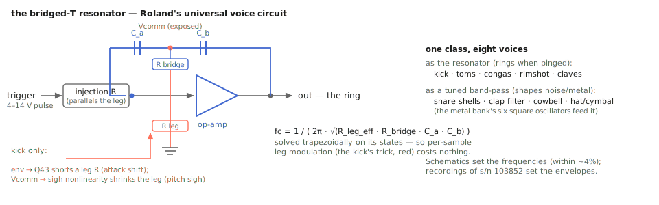

# One network, eight voices: the `tr808_*` headers

Roland built an entire drum machine out of about four circuit ideas, so the
kernel does too: a bridged-T resonator class, a six-oscillator metal bank,
a noise/VCA toolkit, and eight thin per-voice headers that compose them.
This appendix covers the shared blocks' math — the bridged-T's trapezoidal
solve and why the bass drum needs it solved *that* way, the metal bank's
tolerance model — and the per-voice compositions, ending with the
calibration pass that re-fit the family's envelopes against a real unit.

Provenance: the Werner–Abel–Smith papers (the DAFx-14 bass-drum analysis
and the cymbal/cowbell companions) and the TR-808 Service Notes, read
component by component. Every constant in these headers carries a schematic
designator or a paper section; the calibration numbers live in
[`tr808_calibration.ipynb`](https://github.com/tap/TapTools/blob/main/notebooks/tr808_calibration.ipynb).

## `bridged_t.h`: the universal voice circuit



*The network every voice reuses, with the kick's circuit-bending drawn in red.*


An op-amp with a bridged-T network in its feedback path — capacitive arms
`C_a`, `C_b`, a resistive bridge, a resistive leg to ground — rings when
kicked, as a decaying pseudo-sinusoid at

```text
fc = 1 / ( 2π · sqrt(R_leg_eff · R_bridge · C_a · C_b) )
```

where `R_leg_eff` is the leg in parallel with every resistive injection
into the center node. Roland used this network in *every* voice: as the
resonator of the kick, snare, toms/congas, rimshot, and claves, and as the
band-pass of the clap, cowbell, cymbal, and hats. One class, one family.

Two implementation decisions matter:

- **The topology is reproduced, not summarized.** With injections grounded,
  the class's transfer function matches the DAFx-14 paper's printed
  Eqn. (5) coefficient by coefficient (β₂ = α₂ = R_eff·R167·C41·C42, and so
  on); the injected paths match their Hbt2/Hbt3, interchanged by injection
  resistor; and the center node the paper calls `Vcomm` is exposed, because
  the bass drum's pitch-sigh nonlinearity reads it. The whole thing was
  re-derived by nodal analysis and pinned by unit test — the paper is
  trusted, then verified.
- **Trapezoidal on the states, not bilinear on the coefficients.** The
  discretization uses capacitor companion models — a 2×2 linear solve per
  sample — which is algebraically the bilinear transform the paper uses,
  but solved on the network states directly. The reason is the bass drum:
  its leg resistance is *modulated per sample* (the attack shift shorts a
  resistor through Q43; the pitch sigh shrinks the effective leg through a
  fitted nonlinearity). With a coefficient-form biquad that would mean a
  full redesign every sample; with the companion-model solve, a
  time-varying resistor is just a changed matrix entry. Same ZDF family as
  the house `svf.h`.

### The kick, since it exercises everything

`tr808_kick.h` composes the resonator with the paper's full block diagram:
pulse shaper → retrigger network → bridged-T with a feedback buffer closing
a regeneration loop → tone → level. The three signature behaviors are all
emergent from the modeled schematic: for ~6 ms the envelope saturates Q43
and the ring sits near ~129 Hz (the attack punch); as the envelope
collapses, C39/R161/D52 kick the center node again (the retrigger, so the
note doesn't step down); and leakage lifts Q43's base when the center node
swings below a diode drop — the paper's fitted memoryless nonlinearity
(α = 14.315, V₀ = −0.556, m = 1.4765e-5) converts `Vcomm` to a collector
current that shrinks the leg, so big early swings ring sharp and relax down
as the note decays. That is the sigh, and it is a *different mechanism*
from the attack jump — the paper's central untangling, preserved here. One
erratum survives in the header: the paper's Eqn. (9) as printed is garbled,
so the leg formula was re-derived from KCL at Q43's collector and matches
their stated limits.

Accent is the trigger *voltage* — 4–14 V on the bus, mapped from the 0..1
edge amplitude — exciting the network harder, not scaling the output. And
filter states persist across triggers, so rolls interfere with the ringing
tail: no machine-gun effect, by construction rather than by crossfade.

## `swing_vca.h`: the small shared parts

The 808 shapes its percussive gains with one-transistor "swing type" VCAs
driven by RC discharges, not ADSRs. The header holds the three primitives
the noise voices share: `decay_env` (one-pole rise to a level, exponential
decay — retriggering re-aims the rise, no reset click), the linear
`swing_vca` gain (the hardware's "many high harmonics" are a flagged
refinement), and `white_noise` — a seeded xorshift64*, because the 808 has
exactly one noise generator feeding the snare's snappy, the clap, the
maracas, and the toms' noise layer, and because determinism-per-seed is a
house invariant: renders reproduce, tests pin, `mc.` instances decorrelate.

## `metal_bank.h`: six squares and a spread

The metallic voices all draw on one bank of six Schmitt-trigger relaxation
oscillators: nominal 205.3, 369.6, 304.4, 522.7 Hz plus the two
trimmer-tuned at 800 and 540 (the pair the cowbell taps), duty 47.98 % per
the paper's HD14584 analysis. Three modeling calls:

- **Naive squares are faithful.** The fundamentals sit below 1.2 kHz and
  the hash above them is immediately band-passed; the residual aliasing
  folds into the same inharmonic wash the circuit itself produces. PolyBLEP
  would be cost without benefit — a rare sentence in this repo, so it's
  documented.
- **Tolerance is part of the instrument.** The RC parts put any given
  unit's oscillators up to ~20 % off nominal — the paper's measurement, and
  the reason no two 808s' cymbals sound alike. `tolerance` scales a
  deterministic per-seed spread of exactly that width. This is not
  "analog warmth" seasoning; it is a measured production statistic.
- The two band-pass voicings (~3440 and ~7100 Hz, Q fit to the paper's
  published skirts) and the Q19 attack smoother (τ = 102.44 µs less a
  0.7258 V base-emitter drop, their least-squares fit) live here too,
  because cymbal, hats, and cowbell all share them.

## The voices, as compositions

Each `tr808_*.h` is a thin arrangement of the blocks above, with its own
schematic constants:

- **Snare**: two bridged-Ts at the late-revision ~173/336 Hz (the design
  change is documented in the header), a trigger divider, and the snappy
  path — `decay_env`-shaped noise, band-limited near 4 kHz.
- **Clap** (`clap|maracas`): ~2 kHz dual band-pass noise through a VCA
  driven by the Service Notes' Figure-13 three-teeth sawtooth — the
  "multiple hands" transient — plus the Q70 reverberation tail.
- **Hats**: one circuit, two envelope paths, and the hardware choke
  (Q23/R173): a closed-hat trigger terminates a sounding open hat, pinned
  by test. This is why `tap.808.hat~` is one object with two inlets — the
  choke is unimplementable across separate externals.
- **Cymbal**: the bank through both voicings with two separately enveloped
  bands (strike/ring/body), decay spanning the chart's 350–1200 ms.
- **Cowbell**: just the 540/800 pair into the ~860 Hz voicing, two-slope
  envelope.
- **Toms/congas** (`@size` × `@model`): the resonator at the chart tunings
  with the D80/D81 attack pitch fall; toms add a pink-noise layer (pinned
  by seed-sensitivity, since the diode bend's own harmonics defeat spectral
  separation); congas are the same circuit, no noise.
- **Rim/claves**: the ~1667 + 455 Hz crack with the swing-VCA's tanh
  harmonics, versus the pure ~2500 Hz tick.

The family also carries per-channel summing gains (`k_tomc_mix`,
`k_cl_mix` — the hardware's summing resistors into the mix bus): the
bridged-T's impulse gain grows with fc·Q, and before the balance pass the
high conga peaked at ~5.3 while other voices sat far lower. Every voice's
full-accent peak now lands in a consistent ~0.3–1.0 band, pinned by test.

## The calibration pass: what measurement actually changed

The family was calibrated against a real unit (s/n 103852) recorded from
the individual outs with knob positions encoded in the filenames — a
0/2.5/5/7.5/10 dial grid, 116 samples — so the comparison ran per knob
cell, with identical measurements (spectral-peak fundamental, −40 dB decay,
power centroid) on both sides. The result is a clean split:

- **Frequencies: the schematics were right.** Kick within 2.4 %, snare
  within 1.2 % (including the tone-max mode flip), toms/congas/cowbell/
  claves within ~4 %. The kick needed *no constant changed*.
- **Time: the recordings won.** Tom, conga, cowbell, and clap tails roughly
  doubled; the snappy was band-limited and re-enveloped; the rimshot
  re-voiced low-dominant; the cymbal's decay span and brightness corrected;
  the closed hat's brightness residual later resolved by the hats' sizzle
  blend.

Each header carries its calibration note with numbers and residuals. The
lesson is worth stating as a rule: **schematics get you the frequencies;
recordings get you the envelopes** — decay behavior hides in pot tapers,
electrolytic tolerances, and aging that no schematic states.

## The engineering ledger

- **One resonator class vs. per-voice filters.** Eight voices reduce to
  ~4 blocks plus thin compositions only because the bridged-T class keeps
  the injected-path structure of the real network instead of collapsing to
  a generic biquad. The generality was free once the nodal analysis was
  done — and the kick's per-sample leg modulation *required* it.
- **Behavioral envelope generators.** The kick's EG is modeled as fast
  rise / ~1.1 ms release rather than as its own transistor network — the
  paper's own simplification, adopted with its citation. Fidelity effort
  went where the analysis said it matters (the leg, the retrigger, the
  sigh), not uniformly everywhere.
- **The WDF door, left closed but unlocked.** The flagged `@circuit`
  upgrade path (wave digital, the `svf.h` two-circuit pattern) remains
  gated on an A/B showing an audible delta the informed model misses. The
  DAFx-14 paper's own finding — device nonlinearity matters less than
  folklore claims — suggests the gate may never open, which would itself be
  a documented result.
- **Determinism everywhere.** Seeded noise and seeded tolerance mean every
  render, test, and calibration measurement is reproducible bit-for-bit.
  The calibration pass would have been guesswork without it.

## Checkpoint

One network class matching the published transfer functions exactly and
solved on its states so a time-varying resistor costs nothing; a metal bank
whose ±20 % spread is a measurement, not a vibe; voices that are thin
compositions with schematic-designated constants; and a per-knob-cell
calibration pass that confirmed the frequencies, corrected the envelopes,
and wrote its residuals into the headers it changed. Four ideas, eight
voices, every number traceable.
