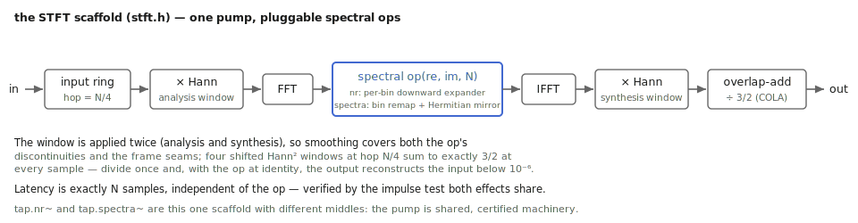

# A gate for every bin

A noise gate is a bouncer with one rule: too quiet, you don't get in. Useful,
but blunt — when the signal plays, all the noise under it walks in too, and
when the signal stops, the gate slams on room tone. `tap.nr~` hires a
thousand bouncers instead: it transforms each STFT frame and applies the
threshold **per frequency bin**, so the quiet bins between your signal's
partials close while the loud ones stay open. Hiss disappears from the gaps
in the spectrum, not just the gaps in time. This chapter is the two knobs,
the two costs, and the one artifact to listen for.

Companion material: the reference page and help patcher in the TapTools-Max
package; the kernel's Catch suite pins the reconstruction claims below.

## The contract: transparent until it isn't

The object runs its own STFT — Hann window, 4× overlap, COLA-normalized
overlap-add — and the engineering contract is pinned by test: **with the gate
open, the output reconstructs the input exactly** (below 10⁻⁶), delayed by
one FFT frame. Whatever `tap.nr~` does to your sound, it is doing it on
purpose with `threshold` and `slope`; the machinery itself is transparent.
Also pinned: a tone below threshold is strongly attenuated; a tone above
passes untouched.

*The pump this object runs on — tap.nr~ is this scaffold with a per-bin downward expander in the middle.*

## The knobs, one by one

### `threshold` — where quiet begins

The per-bin level (linear amplitude) below which a bin is attenuated. The
craft: set it *between* your noise floor and your signal's quietest partials.
Play the noisy source silent for a moment, raise `threshold` until the noise
just vanishes, then stop — every further dB starts eating signal.

### `slope` — how hard the door closes

The soft knee. 0 passes everything (bypass by another name); low values fade
bins gently as they approach the threshold; high values approach a hard
per-bin gate. And here lives the genre's famous artifact: push `slope` hard
with `threshold` high and bins near the boundary flicker open and shut frame
by frame — **musical noise**, a watery, birds-in-the-pipes chirping. The cure
is almost always a gentler slope and a lower threshold, accepting a little
noise instead of a lot of artifact. Half the craft of spectral gating is
knowing when to stop.

### FFT size — resolution vs. smearing (and the latency)

The frame size trades three things at once:

- **Frequency resolution:** bigger frames separate closely spaced partials
  from noise between them — better gating for dense, tonal material.
- **Time smearing:** bigger frames blur transients; a gate decision spreads
  across the whole frame. Percussive material wants smaller frames.
- **Latency:** exactly one FFT frame, by construction. 2048 samples at
  48 kHz is 43 ms — fine on a mix bus, noticeable on a live input.

## Recipes

- **Location dialog cleanup:** moderate frame, `threshold` found by the
  silent-passage method above, `slope` as low as removes the hiss. Listen to
  the *pauses* — that's where both the win and the artifact live.
- **Synth-line de-hiss:** tonal material with stable partials is the best
  case — bigger frames, and the gate closes every bin the notes don't own.
- **Creative abuse:** absurd `threshold` with a hard `slope` isn't repair,
  it's an effect — the signal reduced to its loudest spectral bones. The
  artifact becomes the instrument.

## When it is not the right tool

- **Noise under the signal, not beside it.** A gate — even per-bin — only
  removes noise where the signal *isn't*. Broadband hiss sharing bins with a
  broadband source needs subtraction/statistical methods, a different machine.
- **Hum and buzz.** A 50/60 Hz family is a few known frequencies; surgical
  notches (`tap.filter~`) beat a thousand bouncers who all have to guess.
- **Time-domain gating with musical envelope shaping** — attack/hold/release
  on the whole signal is a classic gate's job, and it doesn't smear
  transients.

## Checkpoint

An STFT expander: per-bin thresholds close the spectrum's quiet gaps, the
machinery reconstructs bit-faithfully when open (pinned below 10⁻⁶), and the
price is one frame of latency plus the musical-noise artifact that appears
exactly when `threshold` and `slope` are pushed past honest. Find the floor,
close the door gently, and stop while the pauses still sound like air instead
of water.
