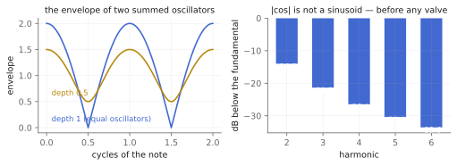
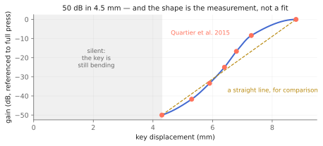
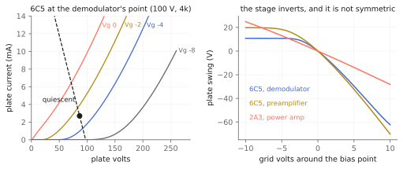
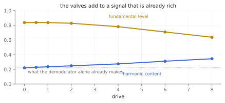

# The instrument that is not a synthesizer

Three objects in this chapter — `tap.ondes~`, `tap.triode~` and
`tap.touche~` — and one instrument. The Ondes Martenot, 1928, the thing
Messiaen wrote for and Jonny Greenwood plays: a keyboard you can also play
with a ribbon on a ring, and a pressure key in the left hand that is the
whole dynamic range of the instrument.

The plan for this family assumed it would be an oscillator with waveform
switches. It is nothing of the kind, and finding that out changed every
decision below.

The Ondes Martenot is **heterodyne**. Two oscillators run near 80 kHz, one
fixed and one moved by the ribbon; they are summed, and the note you hear is
the envelope of their beating. Najnudel, Hélie, Roze and Boutin, who
modelled instrument No. 169 stage by stage (IEEE/ACM TASLP 28, 2651–2660,
2020), measure those oscillators at about **0.03 % second harmonic** even
coupled to the rest of the circuit. They are essentially pure sinewaves.
Every bit of the instrument's character therefore comes from what happens
*after* them: the demodulator, two valve stages, the intensity key, and the
diffuseur.

Companion material: the executed notebooks `ondes.ipynb` and `touche.ipynb`,
`tests/ondes_test.cpp` and `tests/touche_test.cpp`, and the
`radiohead_render` scenes `ondes_stages`, `ondes_ribbon`, `ondes_diffuseurs`
and `triode_tubes`.

## The biggest source of harmonics is not a valve

Two oscillators of equal amplitude sum to an envelope of `2|cos|`. That is
not a sinusoid. Its Fourier series puts the second harmonic **14.0 dB**
below the fundamental, the third **21.3 dB** down and the fourth **26.4 dB**
down — a substantial harmonic series generated before anything nonlinear
touches the signal.

*The demodulator is the instrument's largest single source of harmonics, and it is upstream of every valve.*

This is why `tap.ondes~` does not synthesize a difference tone. Generating
the note as a sinewave and distorting it afterwards would throw away the
part of the timbre that arrives for free — and it is an easy mistake to
make, because the circuit paper *does* say the oscillators can be replaced
by a sinewave generator. That licence applies to the **oscillators**, not to
the demodulator.

The carrier is not simulated either, and that is not a compromise. For
amplitudes 1 and `depth` the envelope is exactly `sqrt(1 + depth² +
2·depth·cos φ)`, so the 80 kHz disappears from the arithmetic rather than
being approximated away. Running the published RC detector on that closed
form matches a full heterodyne-plus-diode-plus-RC simulation to within
**0.10 dB on every harmonic** at every pitch tried.

`depth` is that second amplitude, and it turns out to be the cheapest real
timbre control in the object. At 1 the envelope closes completely and the
series is full; below 1 it never closes and the tone thins toward a
sinusoid. It is a mismatch between two real oscillators, not an invented
knob.

## `detect` — and why the instrument thins as it climbs

The detector is the published one: a triode grid near zero bias conducts on
positive half-cycles and charges instantly, and R4 × C21 = 1 MΩ × 200 pF
discharges it — a **200 µs** time constant, which is `@detect 0.2`.

That single number carries the instrument's pitch character, because an RC
that slow cannot follow a fast envelope back down. Measured here, the second
harmonic runs from −14.0 dB at A2 to −19.3 dB at A6, and the level falls
2.0 dB across those five octaves. The ondes gets purer and quieter as it
goes up, and it does so for a reason you can point at in a schematic.

## The ribbon is linear in semitones

The circuit paper's Eq. 7 gives the variable oscillator's capacitance
against ribbon displacement, and what falls out is
`f = 55 Hz · 2^(d / 12·d₀)`.

So `@ribbon` is **semitones above A1**, not Hz. A hand moving at constant
speed makes a constant-rate glissando; nothing quantizes, and nothing
should. This is why an ondes glide sounds the way it does, and it is the one
place where taking the units from the paper rather than from convention
changes how the object feels to play.

## `tap.touche~` — 50 dB in four and a half millimetres

The intensity key is a graphite-and-mica powder bag working as a rheostat:
compress it and the number of conducting bead paths rises, so resistance
falls. Messiaen called it the instrument's greatest invention. What the
player feels is a well-chosen nonlinear spring.

The curve in this object is **not modelled and not fitted**. Quartier,
Meurisse, Colmars, Frelat and Vaiedelich (*Acta Acustica* 101(2), 421–428,
2015) measured finger force, key displacement and sound simultaneously on
instrument No. 320, and published the boundaries of the six musical nuances
across the key's travel. Those seven points are the object, interpolated
with monotone cubic segments that pass through every one of them.

*Seven measured points, and the shape between them. The straight line is what a fit would have thrown away.*

Three things follow, and each is a decision the paper made rather than this
object:

- **Position, not force and not velocity.** The paper states explicitly that
  the intensity depends on displacement, and *not* on the speed of the
  gesture. A static memoryless map is the finding, not a simplification.
- **50 dB over about 4.5 mm**, from 4.3 mm (the instrument's noise floor) to
  8.8 mm. The paper notes most traditional instruments rarely exceed 25 dB
  of per-note dynamic range.
- **The shape is not a line.** Equal 8.3 dB steps take displacement steps of
  1.0, 0.6, 0.5, 0.4, 0.5 and 1.5 mm. It steepens through the middle and
  flattens hard at the top.

And the thing that surprises everyone who patches it: on a 0–1 control,
**roughly the bottom 45 % of the travel is silent**. That is not a dead zone
in the object. It is the key's own first phase — the elastic strip bending
before it reaches the powder bag — and it is exactly why the instrument can
be attacked so sharply, because the useful 50 dB lives in the 4.5 mm right
after it.

## `tap.triode~` — the stage is a citation

The valves are where the rest of the character is, and there was nothing to
invent. The circuit paper does not merely mention a tube model: it names the
**enhanced Norman Koren** model (Koren, *Glass Audio* 8(5), 1996, with Cohen
& Hélie's grid-current extension, AES 129, 2010), writes out its equations,
and publishes parameter sets **fitted to the actual valves in ondes No. 169**
in its Table II — 6F5 in the oscillators, 6C5 in the demodulator and
preamplifier, 2A3 in the power amplifier — along with each stage's supply
voltage, cathode resistor and plate load.

A stage is then the static solution of the load line, which is a memoryless
nonlinearity in exactly the DAFx-07 sense `tap.fuzz~` uses. Where the fuzz
reaches for a tanh, this one solves a valve.

*Left: the published operating point, solved. Right: the stages invert, and they are visibly lopsided.*

Two properties matter before you patch `tap.triode~` on its own:

- **It inverts**, as a real common-cathode stage does. That is not cosmetic.
  The valve's asymmetry acts on whichever side of the waveform reaches its
  grid, so the sign decides which half gets bent.
- **It is strongly asymmetric.** At the demodulator's operating point, equal
  grid swings either way give plate swings in a **2.17 : 1** ratio. That
  ratio is where a triode's even harmonics come from.

`drive` is normalized out of the level — the gain-staging lesson `tap.fuzz~`
learned the hard way, applied here from the start — so turning it up gets
dirtier rather than louder.

## `drive` on the voice, and where it starts from

*The valves add to a signal that was already rich. The floor is the demodulator's.*

The important thing in that figure is the dotted line. At `@drive 0.` the
tone still measures 0.221 of harmonic content, because the demodulator made
it. The knob sweeps 0.221 → 0.344, monotonically, without the level running
away.

## The two controls that are choices

Most of this object is a citation. Two controls are not, and both are
labelled as such because both measure as audible.

- **`keyplacement`** — the paper's five stages do not include the intensity
  key, so where it sits is undetermined. After the valves (the default) it
  is a clean output law: pressure is level. Before them, pressure drives the
  valves: soft is clean and hard is dirty. The two differ by about 0.09 of
  total harmonic content at a half-press.
- **`polarity`** — the two valve stages are coupled through a transformer
  whose winding sense is not in the source, and the sign decides which side
  of the waveform the preamplifier's asymmetry acts on. Worth about 0.12.

## `power`, and taking the authors at their word

The 2A3 power stage is off by default, following the paper: they measure
almost 5 % second harmonic there, but report its contribution as much less
important than the two stages before it, and drop it for real-time.

Measured here, switching it on moves total harmonic content from 0.248 to
0.251 and the second harmonic by 0.1 dB. They were right, which is why it is
a switch rather than a deletion.

## `oversample`

The nonlinear chain runs oversampled. Worst non-harmonic energy relative to
the fundamental, at 1× / 2× / 4× / 8×:

| tone | 1× | 2× | 4× | 8× |
|------|----|----|----|----|
| 587 Hz | −79.3 | −91.2 | −104.5 | −103.8 |
| 1175 Hz | −65.8 | −77.2 | −90.6 | −92.5 |
| 1760 Hz | −57.6 | −70.9 | −81.1 | −82.2 |
| 2637 Hz | −51.1 | −61.4 | −71.8 | −83.8 |
| 3520 Hz | −45.4 | −56.8 | −67.0 | −74.2 |

Every doubling is worth about 12 dB up to 4×; past that it is worth 7–12 dB
at the top of the range and nothing at the bottom, where the measurement has
already bottomed out. Never worse. 4× is the default because that is where
the cost stops buying uniformly; 8× is there for anyone playing the top
octave hard.

Readers of the `tap.fuzz~` chapter will notice this used to be the *opposite*
of what that object measured. That was not a contradiction — it was the clue
that fixed the fuzz. The appendix explains how.

## What is missing, deliberately

The real instrument has **waveform registers** — switchable timbres. Their
filter shapes are in none of the sources obtained, and inventing them is the
one thing this object will not do.

There is also no diffuseur in `tap.ondes~`, because that is
`tap.metallique~` and `tap.palme~`, and patching one after the other is how
the instrument works anyway.

## Recipes

- **The instrument:** `tap.ondes~` → `tap.palme~ @mix 60`. Ribbon and key on
  signals; that is the whole performance surface.
- **Ribbon on a slider:** `@ribbon` takes a signal, and a `line~` from 0 to
  36 over four seconds is a three-octave glissando that sounds like one
  because the law is linear in semitones.
- **The key alone:** `tap.touche~` on any source. It is a published
  expressive gain law, and nothing about it is ondes-specific once it is
  detached.
- **Thin and pure:** `@depth 0.4 @detect 0.6 @drive 0.`. The envelope never
  closes and the detector smooths what is left.
- **Dirty on hard presses:** `@keyplacement 1 @drive 4 @polarity -1`.
  Pressure drives the valves.
- **A valve on a guitar:** `tap.triode~ @tube 2 @stage 2 @drive 6` — the 2A3
  power stage, used for something it was never in this instrument for.

## When it is not the right tool

- **A subtractive synth.** There is no filter, no envelope generator and no
  waveform selection here. It is one voice with a ribbon and a key.
- **A polyphonic anything.** The instrument is monophonic; so is this.
- **A specific recording.** The valve parameters are a fit to *one*
  instrument's tubes, and tube-to-tube spread in 1930s valves is wide.

## Checkpoint

A heterodyne instrument whose oscillators are nearly pure, so the character
lives downstream: a demodulator whose `2|cos|` envelope makes more harmonics
than either valve does, two valve stages that are a published model with
published parameters, and a pressure key that is a published measurement
interpolated rather than fitted. The ribbon is linear in semitones because
Eq. 7 says so. Two controls are choices rather than reconstructions and are
labelled as choices. The waveform registers are missing on purpose. Every
number here lives twice, as a cell in `ondes.ipynb` or `touche.ipynb` and as
a pinned scenario in `tests/ondes_test.cpp` or `tests/touche_test.cpp`.
