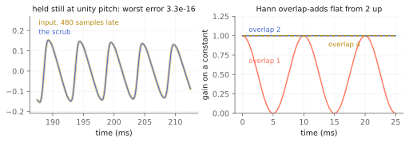
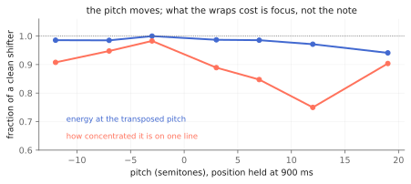

# Two hands on the same tape

`tap.stammer~` and `tap.scrub~` record the same way. Both keep a rolling
tape of what just went past — the same `capture`, literally the same code,
not a second copy of it — and both put a read pattern on top of it. The
stutter's pattern is a slicer with dice. The scrub's is a pad you drag.

That is the whole difference, and it is the difference between a machine
that decides and a machine you play. The stammer is a die you load; the
scrub is a surface you push around, in the Kaoss-pad school of instruments
where an XY surface over live capture is the entire interface. It belongs in
this part of the book for the same reason the tape echo does: nobody sets
this object up and walks away from it.

It is an original design in the granular / brassage tradition (Roads,
*Microsound*, MIT Press 2001) — not a port, and not a reconstruction of any
product. No preset, timing or parameter value in it came from a piece of
hardware.

Companion material: the executed notebook `scrub.ipynb`, the pinned
scenarios in `tests/scrub_test.cpp`, and the `radiohead_render` scenes
`scrub_gesture` and `scrub_freeze`.

## The two axes are actually two axes

`position` is how far back the playhead sits, as a lag in milliseconds
behind the live edge. `pitch` is transposition in semitones. On tape those
would be the same knob — moving the head *is* the pitch change — and the
whole point of doing this with grains is that here they are not. Hold the
position and sweep the pitch and the material transposes without going
anywhere. Sweep the position at a fixed pitch and you rake through the last
few seconds without the tape rising or falling.

`drift` is the third one, and it is the playhead's own motion through the
tape in playback-rate units: `1.` runs forward at the speed the recorder is
writing, `0.` holds station, negative runs backwards. Set `@drift 1.` and
let go of the position and the scrub is a delay; set `@drift 0.` and it is a
freeze that you can still transpose.

## The identity underneath it

Grains are Hann-windowed and fired every `size / overlap` samples. Hann
overlap-adds to exactly 1 at that hop, so with the pitch at unity, `spray`
at zero and the position held on a whole sample, the scrub is *the input,
delayed*, to floating point — 4.4e-16 in the pinned test.

*Left: held still at unity, the object is a delay and nothing else. Right: the window sum that makes it one.*

This matters more than it sounds. Everything else the object does is a
*departure* from a plain delay, and a departure is only trustworthy if you
know the thing it departs from is exact. When the position drags, when the
pitch moves, when spray scatters the origins — those are the object working.
If the still case were approximate, you could not tell them apart from
noise.

`overlap 1` leaves gaps between grains, which is the dipping curve in that
figure. That is a chopped, gated texture rather than a defect, and it is
worth having; it is just not the setting the null lives at.

## What transposing costs, honestly

Reading tape at a rate the write head does not share means the read pointer
drifts away from where the position says it is, and it has to be pulled back
or the position stops meaning anything. Every pull-back is a splice between
two grains reading material a little apart.

What that costs is *not* the pitch. Swept over seven fundamentals and seven
intervals, 98.8 % of a perfect shifter's energy lands within ±15 Hz of the
transposed pitch — worst case 91.7 %. The note is where you asked for it.

What it costs is concentration. The band holds a narrow comb rather than one
clean line: 92.0 % as concentrated as a clean shift, 75.0 % at its worst.

*The pitch goes where you put it. What the splices take is focus.*

Audibly that is a warble, and it is the classic single-delay-line
pitch-shifting artifact rather than anything peculiar to this kernel. If you
want the warble gone, `spray` trades the comb for a broadband smear, which
some material prefers. If you want a clean shift, this is the wrong object —
see below.

## `freeze`, and what it does not stop

`freeze` stops the *recorder*. The playhead keeps going, so the position now
addresses fixed tape and the grains loop the same window: a granular hold
you can still scrub, transpose and drift through. It does not stop time
inside a grain — a grain in flight when freeze engages was already
scheduled, and it finishes.

## `spray` and `seed`

`spray` scatters each grain's origin randomly back from the position. At
exactly 0 the dice are never rolled, so the seed provably cannot matter —
the same contract `tap.garden~` and `tap.stammer~` carry, pinned by the same
kind of test. With spray up, the same seed and the same moves give the same
render bit for bit, and two instances decorrelate by seed alone.

## Recipes

- **The pad:** `@drift 0. @size 80 @overlap 2 @mix 100`, then ride
  `position` with a signal. The default instrument.
- **Granular freeze:** `@freeze 1 @drift 0. @size 120 @spray 40`. Hold, then
  move `pitch` for a chord that was never played.
- **Backwards tape:** `@drift -1. @pitch 0.` — the playhead walking against
  the recorder.
- **Chopped:** `@overlap 1 @size 40`. Gaps between grains, on purpose.
- **Into the diffuseur:** `tap.scrub~` → `tap.palme~` with the palme's
  `@mix` around 40. The strings sustain what the scrub chops.

## When it is not the right tool

- **Clean transposition.** The warble above is inherent to the method.
  `tap.shift~` and `tap.pitchaccum~` are the objects built for that job —
  with one caveat worth stating plainly: measured on this same sweep,
  `tap.pitchaccum~` retained mean 0.908 of band energy with a **worst case
  of 0.004**, well below the scrub's worst of 0.917. That is recorded as an
  open question against `tap.pitchaccum~` rather than a recommendation
  against it, but audition before you assume.
- **A tidy delay.** `tap.delay~` and `tap.tapecho~` cost far less and do not
  window anything.
- **Slicing to a grid.** That is `tap.stammer~`, on the same tape.

## Checkpoint

One tape shared with the stutter, one grain scheduler on top of it, and two
axes that stay independent because grains let them. The still case is a
bit-exact delay, which is what makes every departure from it legible.
Transposing warbles, and the warble is measured rather than apologized for:
the note holds to 98.8 % of a clean shifter's energy, and 92.0 % of its
focus. Every number here lives twice, as a cell in `scrub.ipynb` and as a
pinned scenario in `tests/scrub_test.cpp`.
