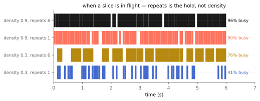
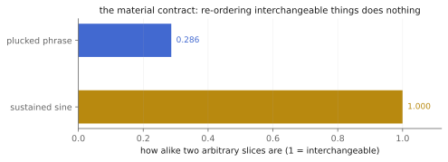

# The part that comes apart

There is a moment at the end of "Go To Sleep" where the guitar stops being a
guitar. It does not fade, it does not filter — it starts eating itself,
firing fragments of the bar you just heard in an order nobody played. That
sound came out of a Max patch Jonny Greenwood built and performs live. So
`tap.stammer~` has an odd position in this package: it is a Max stutter
object, in a Max package, for a technique that was invented in Max.

None of which means anything was copied. This is an **original design** in
the brassage tradition (Roads, *Microsound*) — a continuously recorded
buffer, a rhythmic grid, and dice. What the band's rig contributes is the
knowledge of what the object is *for*, which turns out to be the hard part
of designing one.

Companion material: the executed notebook `stammer.ipynb`, and the
`radiohead_render` scenarios `stammer_grid` (the dials held still so the
mechanism is audible), `stammer_disintegrate` (forty seconds of the
performance the object exists for), and `stammer_two_seeds`.

## How it works, in one paragraph

The input is captured continuously into the last few seconds of history. On
a `step` grid, if the machine is idle, it rolls: with probability `density`
it grabs the material that just went past, chops it to `step` divided by
something between 1 and `divisions`, and plays it back between 1 and
`repeats` times, each pass with a `reverse` chance of running backwards. If
`jump` is open it may reach further back than the bar just played. While a
slice fires you hear the slice; when nothing is firing you hear the input,
untouched.

## `density` and `repeats` — they are not the same dial

This is the one thing worth internalizing before you patch it. `density` is
how often the machine *grabs*; `repeats` is how long it *holds on* once it
has. A slice in flight is never interrupted, so `repeats` is what actually
decides how busy the machine is — and once trains start overlapping, raising
density stops doing anything at all.

*Measured off the object's own playing flag, 100 grid points per run. Repeats is the hold.*

At density 0.3, going from 1 repeat to 6 takes the machine from 41% busy to
76%. At density 0.9 it is already 90% busy with a single repeat, and 96%
with six — the ceiling, where the dial has run out of room.

## `divisions`, `reverse`, `jump` — the character

`divisions` is how finely the grid may be chopped: at 1 you get whole-step
slices, at 8 the machine may cut down to eighths of a step. Because the
divisor is drawn per slice, a high setting gives you a *mixture* of lengths,
not uniformly short ones — which is what keeps it sounding played rather
than gated.

`reverse` is drawn per repeat rather than per slice, so a single train can
stagger forwards and back. `jump` is the reach: at 0 the machine only ever
replays the material immediately past (the classic stutter), and opening it
lets slices come from seconds ago, so the part starts quoting itself out of
order. That is the setting that turns "stuttering" into "disintegrating".

`fade` is the anti-click — a raised-sine flank on each repeat, exactly zero
at the edges and exactly unity across the plateau. Repeats are sequential
rather than overlapped, so every junction dips to zero. That is deliberate:
the dip *is* the articulation of a stutter, and a crossfade there would
smear the thing you want to hear.

## `seed` — the dial that is a contract

Every draw — fire, division, repeat count, reach-back, and the per-repeat
coin for reverse — comes from a seeded generator in a fixed order. So the
same seed and the same moves give the same render, bit for bit. That is not
a nicety; it means a take you liked is recoverable, two instances on
different seeds decorrelate instead of moving in lockstep, and the tests can
assert bitwise equality. A different seed is a genuinely different
performance: 89% of samples change.

And at `density` 0 the dice are never rolled *at all* — so the seed provably
cannot matter, and the object is a bitwise bypass at any mix. Switched off,
this is not "nearly transparent", it is your input. `clear` erases the
capture, drops the slice in flight, and rewinds the seeded stream, so the
same seed replays from there.

## The material contract

The header says this object wants transient material, and that on a
sustained pad a stutter is barely a tremolo. That reads like taste. It is
not — it is a property of the material, and it is measurable.

*How alike two arbitrary slices of the material are. Re-ordering interchangeable things does nothing.*

Every slice of a steady sine looks like every other slice, so shuffling them
changes almost nothing you can hear. Slices of a played phrase are all
different, so shuffling them is the entire effect. Feed this object drums,
plucked or struck strings, consonants — anything whose interest is in *when*
things happen. It re-articulates rhythm that is already in the sound; it
cannot invent rhythm that is not.

## Recipes

- **A grid you can hear:** `@step 250 @density 0.55 @divisions 4 @repeats 4
  @reverse 0.2`. The mechanism, plainly, over a played part.
- **The disintegration:** start at `@density 0.2 @divisions 1 @repeats 1`
  and walk over thirty seconds to `@density 0.9 @divisions 8 @repeats 10
  @reverse 0.6`, tightening `@step` from 250 to 120 as you go. Then open
  `@jump 1500` and the machine starts quoting the wrong bar.
- **Vocal chop:** `@step 125 @density 0.4 @divisions 2 @repeats 3 @fade 6`.
  Consonants are transients; the longer flank keeps it from sounding
  digital.
- **Two of them:** the same settings on two instances with different seeds,
  panned apart. They decorrelate by construction — that is what the seed
  contract buys you.

## When it is not the right tool

- **Sustained material.** See above; it is measured. A tremolo or a gate
  will do more for a pad.
- **Pitched mangling.** Slices play at ±1 rate only — there is no pitch
  shift and no varispeed here. `tap.shift~` transposes; `tap.pitchaccum~`
  spirals.
- **Exact, notated rhythms.** The grid is regular but the dice are dice.
  `tap.808.seq~` sequences; this improvises.
- **Very long repeat trains.** A slice reads from the ring, not a private
  copy, so a train longer than the captured history will start reading
  fresher material as the write head laps it. Size the object argument to
  the longest train you intend to fire.

## Checkpoint

Capture everything, then on a grid roll dice and re-fire what just went
past. `density` grabs, `repeats` holds — and holding is what fills the
timeline. `divisions`, `reverse` and `jump` are the character, and `jump` is
the one that turns a stutter into a disintegration. The seed is a real
contract: same seed, same performance, bit for bit; at density 0, a bitwise
bypass. And the material contract is measured rather than asserted, which is
the honest way to tell you what to feed it. Every number above lives twice:
as an executed cell in `stammer.ipynb` and as a pinned scenario in
`tests/stammer_test.cpp`.
