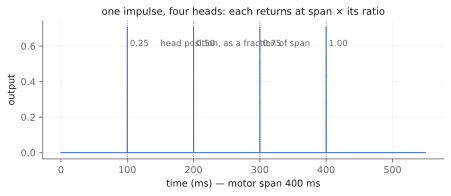
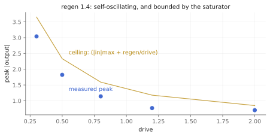

# Four heads and a motor

The last chapter's `tap.discreet~` is a machine you set up and walk away
from. `tap.tapecho~` is one you keep your hands on. Same spool of tape, same
worn return path, same family — but where the Eno objects are systems that
run without you, this one is an instrument, and every parameter on it is a
hand on the machine. That is the thread through this part of the book: these
are the objects you *ride*.

What it recreates is the tape echo of the Copicat / Space Echo school: one
record head, a span of moving tape, several playback heads at fixed
positions along it, and a path from the heads back to the record head. Ed
O'Brien's Copicat is the reason it is here. It is a recreation of the
*topology*, not a circuit model of any one unit — the tape path itself is
the same published tape-echo modeling literature `tap.discreet~` already
stands on (Arnardóttir, Abel, and Smith's AES model of the Echoplex, and
Välimäki et al.'s tape-echo work), and no head spacing, filter curve, or
trim value in this object is claimed as measured from a real machine.

Companion material: the executed notebook `tapecho.ipynb`, which measured
every number below, and the `radiohead_render` tool, whose `tapecho_heads`,
`tapecho_three_head`, `tapecho_selfosc`, and `tapecho_varispeed` scenarios
are the listening copies — all four *performed*, with the controls moving
while they render, because static settings tell you almost nothing about
this object.

## `span` — the motor

`span` is the delay of a head sitting at the far end of the tape path, and
every other head sits at `span` times its own ratio. So `span` is not "the
delay time" of one echo; it is the motor speed, and moving it moves the
whole layout together.



*One impulse, four heads. The returns land exactly on `span × ratio`.*

Moving the motor while audio runs is a tape-speed change, which means it
bends pitch on the way — the same doppler contract as `tap.discreet~`, for
the same reason: the heads are physically moving relative to the tape.
`smooth` sets how long the motor takes to change speed, and therefore how
deep the bend is. There is no crossfading "digital" mode. If a pitch bend on
a delay-time change would ruin the patch, reach for `tap.delay~`.

## `heads`, `ratios`, `levels`, `pans` — the layout

Four heads by default, evenly spaced at 0.25, 0.5, 0.75 and 1.0 of the span.
That spacing is *nominal* — chosen because it is neutral and audibly a tape
echo — and every ratio is freely settable underneath, which is how you build
a three-head Copicat-style layout:

```
heads 3, ratios 0.333 0.667 1.
```

`levels` is per-head gain and `pans` places each head in the stereo field
(equal-power, with exact endpoints: a hard-panned head is bitwise absent
from the far bus). One thing to know: **a head's level is also its send into
the regeneration path**, as the head selector on the real machines is. Turn
a head down and you are turning down both what you hear from it and what it
feeds back.

## `regen`, `drive`, `darken` — past unity, on purpose

Here is where this object parts company with everything else in the house.
`tap.delay~` caps feedback at 0.99 so the loop is always contractive.
`tap.discreet~` reaches exactly 1.0 because the wear path is the stabilizer.
`tap.tapecho~` goes **past** 1.0 — up to 1.5 — into deliberate
sound-on-sound self-oscillation, the howl you reach for this machine to get.

It stays bounded because the saturator does. `drive` is record-head
saturation, and its output can never exceed 1/drive no matter what the loop
accumulates, so the tape is bounded by the input plus regen/drive whatever
the loop gain. The measurement is the point:



*Regeneration at 1.4 — well past unity — plateaus under the saturator's ceiling at every drive.*

Because that bound *only* exists while the saturator is engaged, the
effective regeneration is capped back to 1.0 whenever `drive` is 0 — and the
cap is applied per sample, so dropping drive mid-howl lands the loop rather
than letting it run away. The attribute keeps its value and takes effect
again when drive returns. Twelve seconds of ring at regen 1.4 measures a
growth ratio of 1.007 between the two late windows: it plateaus, it does not
climb.

`darken` is the per-pass corner. Every trip through the regeneration path
runs through a one-pole lowpass, so the repeats lose treble generation by
generation — measured at 0.2915 of a 6 kHz tone per pass against 0.2920
predicted, and 0.8895 of a 300 Hz tone against 0.8898. Riding `darken`
*while the loop howls* is a performance control, not a set-up step; it is
what turns a howl into a swell and back.

## `wow` and `flutter` — one motor, one path

The transport is the family's deterministic pair of sines, and one motor
moves the whole tape path, so a speed error displaces every head together.
The pitch math is checkable in closed form: depth times 2π times rate is the
peak deviation, so 2 ms at 0.5 Hz predicts ±10.88 cents and the notebook's
pitch track measures 10.91. Two renders of the same settings are
bit-identical — periodic and deterministic by design, with stochastic
capstan drift a documented non-goal, because bit-exact renders are what let
the oracle test exist at all. Set both depths to 0 for a still machine.

## The one that is not a knob

With the tape path neutralized — no transport error, no regeneration — a
one-head echo is **bitwise** `tap.multitap~` with one tap. Same Hermite
read, same fractional position, same equal-power pan law. That is not a
curiosity; it is the whole design claim, measured: this object is
composition over the shared tape machinery rather than a second
implementation of it, and `tape_loop.h` needed no changes at all to serve a
topology it was not written for. The appendix has the derivation.

## Recipes

- **The Copicat:** `heads 3, ratios 0.333 0.667 1.` with `@span 390 @regen
  0.6 @drive 0.9 @darken 2600 @wow 0.9 0.9 @mix 50`. Heads down the middle,
  a tired transport, repeats that thicken as they recirculate.
- **A wide slap:** four heads, `pans -0.7 0.5 -0.35 0.8`, `@span 480 @regen
  0.45 @drive 0.4 @mix 45`. The layout does the widening; no chorus needed.
- **Sound-on-sound:** `@drive 0.7 @regen 1.35`, then bring `@input` to 0 and
  take your hands off. Ride `@darken` down to 1400 while it howls, then
  `@regen 0.55` to bring it home. `clear` is the emergency stop.
- **The dive:** `@smooth 3000`, then `@span 200` → `@span 900`. Three
  seconds of tape slowing down, with everything already on the tape bending
  with it.

## When it is not the right tool

- **Tempo-locked delays.** Span changes bend pitch by design and there is no
  sync. `tap.delay~` is the clean line.
- **A wash you set and leave.** That is `tap.discreet~`, one chapter back —
  same machinery, opposite posture.
- **Independent free-running loops.** One motor moves every head here. For
  loops that drift against each other, `tap.airport~`.
- **Clean repeats.** Wear is always in the regeneration path; `drive 0`
  removes the saturation, not the darkening.

## Checkpoint

A motor and up to four heads along one tape path; the motor moves them
together and bends pitch doing it. Regeneration goes past unity into
self-oscillation, bounded by the saturator rather than a gain cap, and
capped back to 1.0 the moment drive leaves. The transport is two
deterministic sines measured in cents. And with the tape path neutral the
whole object collapses, bitwise, into a delay this library already had —
which is how you know it is composition and not a rewrite. Every number
above lives twice: as an executed cell in `tapecho.ipynb` and as a pinned
scenario in `tests/tapecho_test.cpp`, which CI runs on every push.
