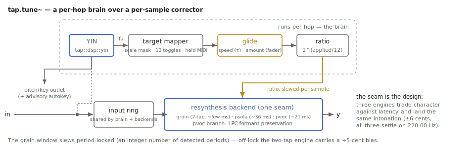

# The note you meant

Every sung note is two notes: the one that happened and the one you meant.
`tap.tune~` measures the distance between them and closes it — how fast it
closes it is the whole instrument. Closed slowly, nobody knows it was there.
Closed instantly, everybody knows: that snap *is* the most famous vocal
effect of the last twenty-five years. One object, one time constant, both
worlds.

A short history matters here, told plainly. The classic pipeline — detect
the pitch, snap it to the nearest allowed note, retune by time-domain
resynthesis — was patented in 1998 and the patent expired in 2018, which is
why a whole field of tuners exists today and why this object can implement
the technique from the literature. The famous product *name* remains a live
trademark, which is why this object is called `tap.tune~` and this chapter
says "hard snap" instead. And editing individual notes *inside a chord*
remains patent-fenced territory — `tap.tune~` is monophonic by design, not
by omission. (None of this paragraph is legal advice; the project's own
ship-gate is a freedom-to-operate review.)

Companion material: the reference page and help patcher in the TapTools-Max
package, the runtime maxtest, and two executed notebooks — `tune.ipynb`
here and `pitchshift.ipynb` in the DspTap repo — that measured every claim
below.

*A per-hop brain over a per-sample corrector, with one seam where three resynthesis engines interchange.*

## The knob that is the instrument: `speed`

`speed` is the time constant, in milliseconds, of the glide onto the target
note.

- **0 ms** — the hard snap. The correction lands within a detection hop
  (~5 ms). Vibrato gets quantized into terraces; note transitions become
  instant staircase steps. This is the effect, worn on the outside.
- **10–40 ms** — classic correction. Fast enough that a listener hears "a
  singer with good intonation," slow enough that the attack of each note —
  where identity lives — is not robotic. The default is 20.
- **100 ms and up** — intonation *leaning*. The corrector arrives so late it
  only tames drift; vibrato passes through nearly untouched.

The notebook's pitch-track figure shows all three glides onto the same
46-cent-sharp note; the kernel test pins the exponential's arrival. There is
also `amount` (0–100%): a fader on the correction distance itself. 100
lands on the target; 50 splits the difference — a gentler kind of honesty
that keeps a performance's shape while shrinking its errors.

## Telling it what is allowed

The corrector never invents a target; it snaps to the nearest note *you
allowed*.

- **`key` + `scale`** — the usual contract: `@key d @scale major` and every
  detected pitch pulls toward the nearest D-major degree. Presets:
  chromatic, major, minor, harmonic, melodic, pentatonic, minorpentatonic.
- **`notes`** — the twelve toggles, absolute pitch classes C through B,
  panel-style: `notes 1 0 0 0 1 0 0 1 0 0 0 0` snaps everything to a
  C-major triad, which is less a correction than an arrangement decision.
- **`mode midi`** — the target is the nearest *currently held* MIDI note
  (`note 64 100` holds E4; velocity 0 releases; `flush` clears). Hold one
  note and everything becomes that note; hold a changing chord's roots and
  the corrector is suddenly a performable melody-mangler. No notes held
  means no correction — the object never guesses.

An empty mask behaves the same way: nothing allowed, nothing changed.

## Three engines, one corrector: `backend`

Detection, targeting, and the glide are shared; only the resynthesis swaps.
All three land the same intonation — the notebook drives the same vibrato
"voice" through each and all three settle on 220.00 Hz — so the choice is
about character and latency, not accuracy.

| backend | what it is | choose it for | latency @ 48 kHz |
|---|---|---|---|
| `grain` | two-tap delay-line, window locked to the detected period (the `tap.shift~` engine) | the default; lowest latency, waveform-preserving, happy on any material | a few ms |
| `psola` | true TD-PSOLA | voice — it preserves formants by construction | ~36 ms |
| `pvoc` | peak-locked phase vocoder | dense, harmonically rich material; pairs with `formant` | ~21 ms |

Switching live is click-safe: the incoming engine starts from silence and
fades in rather than splicing stale audio. One honest caveat per engine:
`grain` colors sustained *unpitched* input with a mild moving comb (the
known trade of its class); `psola` wants harmonic material — on a pure
sine shifted far, its output legitimately thins (the machine chapter
explains why that is the same property as its formant preservation);
`pvoc` smears sharp transients slightly, as every phase vocoder does.

## Keeping the singer's mouth: `formant`

A correction of thirty cents moves formants thirty cents — nobody hears it.
A MIDI-mode command of five semitones moves them five semitones — everybody
hears it; that is the chipmunk. `@formant 1` enables LPC formant
preservation on the `pvoc` backend: the pitch moves, the vocal tract's
envelope stays where the singer put it. The notebook corrects a synthetic
voice up 5.5 semitones both ways; with the flag on, the formant bump stays
put (band-energy ratio 730:1 in its favor). `psola` needs no flag — formant
preservation is its resampling rule — and `grain` ignores the flag.

## Letting it find the key: `autokey`

`@autokey 1` starts a learner: every voiced detection drops its pitch class
into a histogram that forgets with about a minute of memory, scored against
the published Krumhansl–Kessler key profiles. Two design decisions worth
knowing:

- **It never acts on its own.** A key estimate that silently re-aimed your
  targets mid-phrase would be a bug wearing a feature's clothes. `getkey`
  asks (the right outlet answers `key d major 0.95`, or `key none` in the
  first half-second); `applykey` adopts the estimate into the `key` and
  `scale` attributes — visibly, where you can see and undo it.
- **It forgets on purpose.** The one-minute memory means a modulation stops
  arguing with the old verse about as fast as you stop playing it.

The kernel test plays a D-major scale and reads back D major at 0.95
confidence; an A harmonic-minor melody reads as A minor.

## The right outlet

While the input is voiced, the right outlet reports
`pitch <midi> <hz>` every `@interval` milliseconds (default 50; 0 disables;
a `pitch -1 0` marks the end of voicing). That is a free tuner display, a
melody recorder, or the control signal for whatever you want to drive with
the singer's pitch — and it is the same detector the corrector itself uses,
so what you see is what it acted on.

## Recipes

- **Invisible repair:** `@scale major @key` (your key) `@speed 25
  @amount 80`. The 80 keeps a little humanity in the intonation; nobody
  will name what changed.
- **The famous one:** `@speed 0 @scale minorpentatonic`. Fewer allowed
  notes make the terraces wider and the snap prouder. Add melisma.
- **One-note choir:** `@mode midi @speed 5`, hold a note, feed it speech.
  Everything becomes chant on that pitch.
- **Formant-true transposer:** `@mode midi @backend pvoc @formant 1
  @speed 10`, play a melody against a held vocal — a harmonizer that keeps
  the singer's identity.
- **Tuner display only:** `@amount 0 @interval 20` — the object corrects
  nothing and the right outlet becomes a clean pitch stream.

## When it is not the right tool

- **Chords.** The detector is monophonic; a chord reads as garbage or as
  its loudest note, and per-note polyphonic editing is deliberately out of
  scope (see the history paragraph). Split voices first, or don't.
- **Drums, breath, speech consonants.** Unpitched input passes through with
  no correction — by design — but the grain engine adds its mild comb
  coloration to sustained noise. For processing unpitched material there
  are better rooms in this house.
- **Creative shifting.** If the goal is *an interval* rather than
  *intonation*, `tap.shift~` is the plain shifter and `tap.pitchaccum~`
  the spiral; `tap.tune~` always measures first and that measurement is
  latency you don't need.

## Checkpoint

Detect, snap to the nearest allowed note, glide at `speed` — that is the
whole machine, and `speed` is the dial between honesty and effect. Targets
come from key + scale, twelve toggles, or held MIDI notes; three resynthesis
engines trade character against latency while landing the same intonation;
`formant` keeps the singer's mouth in place when corrections get big;
`autokey` learns the key but only ever suggests. The right outlet tells you
what it heard. And when the input isn't a single pitched voice, the honest
move — which the object makes — is to change nothing.
