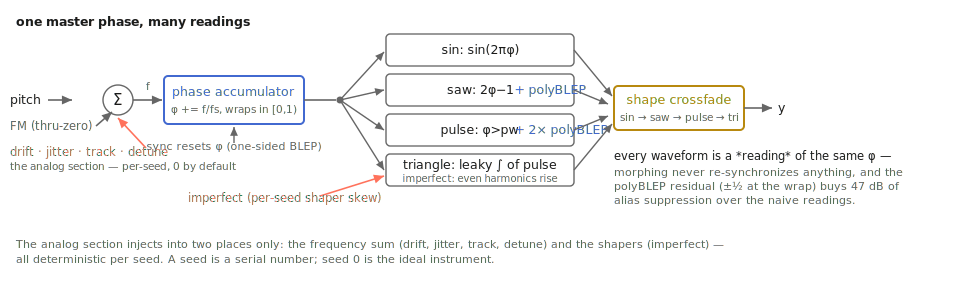

# The oscillator and its knobs

Play a perfectly calculated sawtooth for ten seconds and you will learn
something uncomfortable: perfection sounds like a diagram. Every cycle
identical, every harmonic exactly where the textbook puts it, nothing moving —
the ear files it under *test tone* and stops listening. Now play three of them,
each a few cents off the others and each wandering a little, into a filter that
pushes back — and the same arithmetic becomes a synthesizer. This chapter is
about `tap.vco~`: what it generates, what each attribute trades, and how to get
from the diagram to the instrument — including the honest version of the Moog
recipe.

Companion material: the object's reference page (`docs/tap.vco~.maxref.xml`)
and help patcher (`help/tap.vco~.maxhelp` in the TapTools-Max package) wire up
every control in this chapter; the
[verification notebook](https://github.com/tap/TapTools/blob/main/notebooks/vco.ipynb)
shows every number quoted here as an executed, plotted measurement.

## One phase, four shapes, no aliasing panic

Inside the object there is a single master phase ramping from 0 to 1 at the
frequency you asked for. Everything else is a way of *reading* that phase: a
sine reads it through `sin`, a saw stretches it to ±1, a pulse compares it to
the pulse width, and the triangle integrates the pulse (the classic analog
trick, reproduced digitally because it behaves so well). The continuous `shape`
parameter (0 sine → 1 triangle → 2 saw → 3 pulse) crossfades adjacent readings
of the *same* phase, so a shape sweep glides through hybrid waveforms without
resetting anything.

The digital oscillator's ancient enemy is aliasing: a naive saw's harmonics
march past Nyquist and fold back as inharmonic garbage. `tap.vco~` suppresses
this with polyBLEP — each waveform discontinuity is rounded across ±1 sample by
a polynomial that closely matches what a band-limited step would do. Measured
against a naive saw at 3951 Hz (a B7, ugly on purpose): the 13th harmonic folds
back to 3.4 kHz, where the naive saw puts it at −27 dB and `tap.vco~` puts it at
−74 dB — **47 dB of alias suppression** right where the ear is most offended.

Two things about this are worth knowing so they don't surprise you:

- **The waveforms look "not band-limited" on a scope.** Expected. The BLEP
  correction touches two samples per edge — at 440 Hz that's 2 of ~109 samples
  per cycle — and there is none of the Gibbs ripple that brickwall band-limited
  waves show, because nothing is truncated. The shape stays essentially ideal;
  the *spectrum* is what's controlled.
- **Alias suppression is not alias elimination.** Push the fundamental into the
  kilohertz range and distant fold-backs remain, tens of dB down. For melodic
  and bass registers they are simply gone.

## The wiring

```text
   frequency (signal or float)     FM, in Hz (signal)     sync (signal)
              |                          |                     |
        +-----+--------------------------+---------------------+-----+
        |                       tap.vco~                              |
        +-----------------------------+-------------------------------+
                                      |
                              (signal) the waveform
```

- **Inlet 1** sets the frequency — a float sets the attribute, a signal drives
  it with true per-sample resolution.
- **Inlet 2** is through-zero linear FM, calibrated **in Hz**: the input adds
  directly to the effective frequency. Drive it past the carrier and the phase
  genuinely runs backward (that's the "through zero" — the classic DX-style
  sideband sound stays coherent instead of collapsing). Measured: a 500 Hz sine
  carrier under ±900 Hz of FM stays bounded at exactly 1.0 peak and puts its
  sidebands where the textbook says.
- **Inlet 3** is hard sync: every rising zero crossing of the input resets the
  phase, with sub-sample accuracy and an alias correction on the reset.
  Measured: a 187 Hz slave synced to a 110 Hz master emerges periodic at
  110.1 Hz — the pitch follows the master, the *timbre* follows the slave's
  frequency, which is the whole trick of sync sweeps.

Single-channel, like every TapTools DSP object: wrap it in `mc.` for stacks,
and keep reading, because the analog section was designed around exactly that.



*One phase, many readings — with polyBLEP correcting the edges and the analog section injecting in exactly two places.*

## The knobs, one by one

### `frequency`, and gliding

Hz, from LFO rates (0.01 Hz) to 20 kHz. Every parameter in the object rides a
per-sample ramp whose length is the `smooth` attribute (ms, default 20) — and
on `frequency` that ramp *is* portamento. Set `smooth` to 60–100 ms, send note
frequencies as floats, and you have the Minimoog glide, no extra objects. For
stepped pitch, set `smooth` low; for per-sample modulation, use the signal
inlet (which bypasses smoothing entirely — you are the smoothing).

### `shape` and `waveform`

`shape` is the continuous morph; the `waveform sine|triangle|saw|pulse` message
snaps it to a corner. The corners are the pure shapes; everything between is a
crossfade of neighbors on the shared phase. Slow `shape` sweeps are an
underrated modulation destination — the morph is click-free by construction
(measured: a 2-second sweep from 0 to 3 keeps its RMS within a factor of ~5 and
never drops out).

### `pw` — pulse width

Percent, 1–99, audible as `shape` approaches 3. The calibration is exact: a
bipolar pulse at duty *d* must average 2d−1, and the measured means at 10/25/50 %
are −0.800/−0.500/+0.000. PWM by an LFO into `pw` (via messages, riding the
`smooth` ramp) is the cheapest "two oscillators" impression one oscillator can
give.

### `gain`, presets, `interp`

`gain` is output level in dB. Sixteen preset slots store every parameter
(`store 1` … `store 16`), and `recall` **morphs** to a slot over `interp`
milliseconds (or an explicit time: `recall 3 4000`) — every parameter riding
its ramp simultaneously, shape included. A preset morph across two very
different voicings is a patch element in its own right.

### `seed` — which unit you own

Everything random in this oscillator — the drift walk, the jitter noise, and
(below) the component tolerances — is generated deterministically from `seed`.
Same seed, same render, bit for bit: your mixes reproduce and the test suite
can pin behavior exactly. Different seeds decorrelate. The mental model that
pays off: **a seed is a serial number.** One `tap.vco~` with seed 7 is a
particular oscillator that came off the line; seed 8 is the unit next to it in
the crate. An `mc.` stack with per-voice seeds is a *set* of instruments, not
copies of one.

## The analog section

Here is why a hardware oscillator sounds alive, reduced to what a DSP model can
honestly act on. A real VCO is unstable at **two time scales** — it wanders
over seconds (thermal drift) and trembles over milliseconds (noise in the core)
— it is **mis-calibrated in a structured way** (the V/oct converter is exact at
its trim point and increasingly wrong away from it), and its **waveforms carry
the circuit's fingerprints** (a bowed ramp, a rounded reset corner, a duty
cycle that isn't quite 50 %). None of these is large. All of them are always
present, all slightly different from unit to unit, and the ear reads their sum
as *alive* long before it can name any of them.

`tap.vco~` models each one with its own control, all in real units, all
deterministic per seed, and all **exactly zero by default** — the default
object is the ideal oscillator, and the kernel's test suite pins that at
imperfect 0 every seed renders bit-identically.

### `drift` — the slow wander (cents)

A random walk: sample-and-hold noise at ~2 Hz smoothed through a ~0.5 Hz
one-pole, scaled to the depth you set. This is the thermal story — the pitch
center strolling around over seconds. In a unison stack it is the difference
between "chorus effect" and "three players": chorus modulation is periodic and
shared; drift is aperiodic and per-voice. **Ranges:** 3–8 cents reads as a
well-serviced vintage instrument; 15–25 as a charming one; 50+ as a broken one.

### `jitter` — the fast tremble (cents)

New with this chapter: the short-time companion — noise at ~80 Hz through a
~40 Hz smoother, so the pitch trembles cycle-to-cycle instead of strolling.
Measured at 10 cents depth: the relative spread of individual periods is
2.7×10⁻³ (a few cents, exactly as labeled), against 2×10⁻⁷ for the ideal
oscillator — four orders of magnitude more *micro*-instability, still nothing
like vibrato. This is the control that stops a sustained single oscillator
from sounding frozen. **Ranges:** 1–4 cents is felt more than heard; 8–15 is
audible grit on pure waveforms.

### `detune` and `track` — the calibration story (cents, cents/octave)

`detune` is the static offset — the coarse fact that oscillator 2 was never
exactly oscillator 1. `track` is subtler and very analog: **cents of error per
octave from A440**, the exponential converter drifting from its trim point.
Measured with `track 5`: exactly 0.0 cents at A440, +15.0 cents three octaves
up, −15.0 three octaves down, a clean line through the middle. Solo it is
nearly invisible; in a stack played across the keyboard it is why vintage
unisons get *wider* — and slightly wilder — up the neck. **Ranges:** real
serviced hardware tracks within 1–3 cents/octave; ±5 is a synth that needs its
yearly appointment.

### `imperfect` — the circuit's fingerprints (0..1)

One knob for the waveform-shape story, scaled by per-seed **component
tolerances** so each seed misbehaves in its own direction:

- the saw ramp bows into the familiar shark-fin (a visible, scope-obvious
  shape change; spectrally it is mostly a phase effect — stated here so you
  don't chase magnitude changes that aren't there),
- the saw's reset corner rounds off: a gentle one-pole closing from ~22 kHz
  toward ~8 kHz — measured 6.4 dB down at the 40th harmonic (17.6 kHz) at
  full imperfection; extreme top-end air, traded for warmth,
- the triangle goes asymmetric, and this one is *very* audible in the spectrum:
  the ideal triangle's 2nd harmonic sits at −185 dB (i.e., absent); at
  `imperfect 0.8` it rises to −34 dB relative to the fundamental — even
  harmonics, the classic "warm" giveaway,
- the sine picks up mild waveshaper color, and the pulse width takes a small
  static offset (so two "50 %" pulses from two seeds beat against each other
  the way two real units do),
- the whole unit takes a static pitch offset of up to a couple of cents.

**Ranges:** 0.2–0.4 is a healthy vintage unit; 0.6–0.8 is character you can
point to in a mix; 1.0 is a unit with a story. At 0, every seed is the same
ideal machine — the analog section never costs you the reference oscillator.

## The Moog recipe, honestly

The sound everyone wants from this object is three oscillators into a ladder.
Here is the recipe, with the honest accounting of which ingredient does what.
Rendered A/B demos of exactly this patch (through the real kernels) live in the
notebook material.

| voice | frequency | `detune` | `drift` | `seed` |
|-------|-----------|----------|---------|--------|
| 1     | f         | −4 c     | 8 c     | 11     |
| 2     | f         | +5 c     | 8 c     | 22     |
| 3     | f ÷ 2     | +2 c     | 10 c    | 33     |

- All three: `@shape 2` (saw), `@smooth 70` for glide, `@jitter 3`,
  `@track 2`, `@imperfect 0.3`.
- Sum them (scale by ~1/2.8) and feed **`tap.ladder~`**:
  `@mode lp24 @resonance 0.35 @drive 9 @asym 0.45 @comp 0.25`.

What each ingredient buys, in order of importance:

1. **The stack itself.** Three free-running voices at ±cents is most of the
   sound. The beating between them is the fatness; the octave-down third voice
   is the weight. (`tap.vco~` free-runs like hardware — no per-note phase
   reset — so the beat pattern is different on every note. That, not any
   single voice's tone, is the big analog tell.)
2. **The ladder.** `drive` into the tanh stages compresses and colors the
   stack; `asym` adds the even harmonics of mismatched transistors; `comp`
   kept low preserves the authentic passband droop as resonance rises. A
   perfect saw into a driven asymmetric ladder sounds more "Moog" than an
   imperfect saw into a clean one — spend your character budget here first.
3. **Glide.** 60–100 ms of `smooth` on the note changes. Iconic, and free.
4. **The analog section.** Drift keeps the beating from ever repeating;
   jitter un-freezes sustains; per-seed tolerances make the three voices three
   *units*. This is seasoning — essential in the way salt is, invisible in the
   way salt is.

Omit in reverse order when CPU or taste says so.

## When it is not the right tool

- **You need an exact test signal.** Actually — it *is* the right tool:
  `imperfect 0` (the default) is the mathematically ideal oscillator, and the
  test suite holds it there. Just don't reach for the analog section and a
  measurement mic in the same patch.
- **You want evolving spectra from one voice** — wavetables, granular motion,
  additive drift. This oscillator's spectrum is fixed per shape by design;
  morph `shape` or FM it, but a wavetable oscillator is a different instrument.
- **You want chorus.** Twenty cents of drift on one voice is not a chorus; it
  is a seasick oscillator. Chorus is a delay effect — use one.
- **Noise.** The bottom of the `shape` range is a sine, not a noise source;
  `tap.noise~` has five colors of the real thing.

## Checkpoint

One master phase, four shapes and their hybrids, polyBLEP keeping the folded
harmonics ~47 dB down. Frequency glides on `smooth`, FM is in honest Hz and
survives through zero, sync locks pitch to the master while timbre stays yours.
The analog section is four controls with real units — slow `drift`, fast
`jitter`, structured mis-calibration in `track`, circuit fingerprints in
`imperfect` — all scaled by per-seed component tolerances, all exactly off by
default, all deterministic: a seed is a serial number. And the Moog recipe is
mostly the stack and the ladder — let the oscillator's imperfections season,
not carry.
