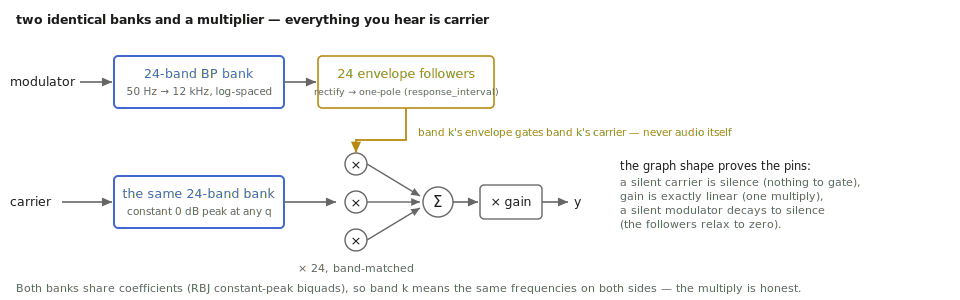

# Making the machine talk

The vocoder is audio's oldest identity theft: take the *shape* of one sound
and wear it over the *body* of another. Speech works because your mouth
sculpts a moving spectral envelope; a vocoder measures that envelope on one
signal (the **modulator** — usually a voice) and stamps it onto another (the
**carrier** — usually a synth), and the synth talks. `tap.vocoder~` is the
classic architecture: a 24-band channel vocoder, time-domain, no FFT. This
chapter is how to wire it and — mostly — how to choose the two signals, which
is nine tenths of vocoding.

Companion material: the reference page and help patcher in the TapTools-Max
package; the kernel's Catch suite pins the structural behavior quoted below.

## The machine, in one pass

Two identical banks of 24 bandpass filters, log-spaced from 50 Hz to 12 kHz
(RBJ constant-peak biquads — unconditionally stable across the range). The
modulator goes through one bank; a per-band envelope follower measures each
band's level. The carrier goes through the other bank; each carrier band is
multiplied by the matching modulator envelope; the bands are summed. That's
the whole machine — which is why its behavior is so predictable:

- **A silent carrier is silence**, no matter what the modulator does (pinned
  by test): the modulator only ever *gates*; every sample you hear is
  carrier.
- **Gain is exactly linear** (pinned): the vocoder adds no nonlinearity of
  its own.
- **A silent modulator decays to silence** at the follower rate — the vocoder
  "lets go" of the carrier the way the voice lets go of a word.

## The wiring

Modulator in the **left** inlet, carrier in the **right**. Getting these
backwards is the classic first-patch bug, and it sounds like it: a synth
"speaking" your voice is right; your voice weakly filtered by a synth is
backwards.

*Two identical banks meeting at 24 multipliers. Envelopes gate the carrier; modulator audio never reaches the output.*

## The knobs, one by one

### `q` — intelligibility vs. smoothness

The bandwidth of all 48 filters. Narrow (high q) separates the bands
cleanly — crisper consonant detail, more "robot" — but thins the carrier
between band centers. Wide (low q) overlaps the bands into a smoother, duller
blend. The classic hardware vocoders sat toward smooth; intelligibility came
from performance, not q.

### `response_interval` — how fast the mouth moves

The envelope followers' period in ms. Short tracks every consonant — crisp,
maximally intelligible, and a little nervous. Long smears syllables into
pads — the "choir" setting. This knob is the vocoder's attack *and* release;
20–50 ms speaks, 200+ ms sings.

### `gain`

Makeup level, since a band-multiplied signal usually lands quieter than
either input. Linear, boring, necessary.

## Choosing the two signals (the actual craft)

- **The carrier must have energy where the modulator has bands.** The eternal
  vocoder failure is a dull carrier: a mellow sine pad gives the high bands
  nothing to gate, and consonants vanish. The house answer is upstairs in
  this book — a `tap.vco~` **saw stack** (harmonics forever, and the analog
  section keeps it moving) is a nearly ideal carrier; noise (`tap.noise~`)
  blended in restores the *s* and *t* sounds that even a saw can't carry.
- **The modulator wants articulation, not fidelity.** Overdriven, compressed,
  even cheap-microphone speech vocodes *better* — what matters is envelope
  contrast between bands, not beauty.
- **Nobody said voice.** Drums modulating a pad turns the pad into rhythm;
  a cello modulating noise is a ghost. The machine imposes *any* moving
  envelope on *any* body.

## Recipes

- **The talking synth:** speech → left; `tap.vco~` saw stack + 10 % noise →
  right; `response_interval 30`, `q` middling, and enunciate like you're
  annoyed.
- **The choir:** sustained "aah"s → left; detuned saws → right;
  `response_interval 250`. Consonants don't matter; vowels are the chord.
- **Rhythm transfer:** a drum loop → left; anything sustained → right; short
  `response_interval`. The drums play the pad.

## When it is not the right tool

- **Pitch correction or transposition** — a channel vocoder never changes the
  carrier's pitch; it only shades its bands. Pitch is `tap.shift~` /
  `tap.pitchaccum~` territory.
- **High-fidelity cross-synthesis.** Twenty-four bands is a *voice*, not a
  spectrograph; for surgical spectral morphing you want FFT-domain tools
  (`tap.spectra~` is the start of that corridor).
- **Formant preservation while shifting** — related, but a different machine.

## Checkpoint

Two matched 24-band banks, 50 Hz–12 kHz: the modulator's per-band envelopes
gate the carrier's bands, and everything you hear is carrier. `q` trades
crispness against smoothness, `response_interval` is the mouth's speed, and
the craft is almost entirely in feeding it a bright, busy carrier and an
articulate modulator. The machine is simple; the casting is everything.
